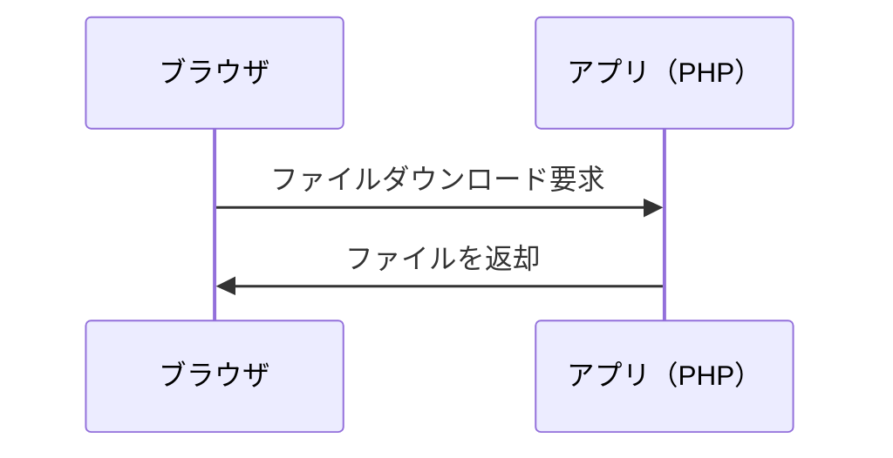
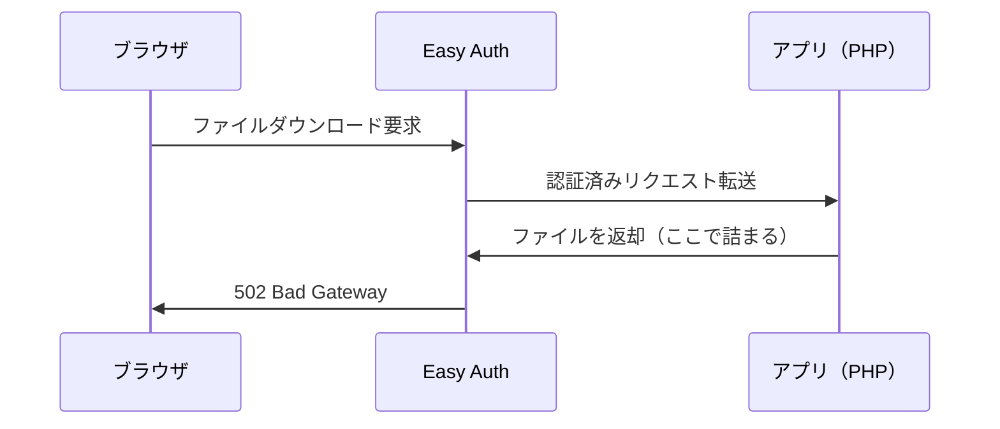
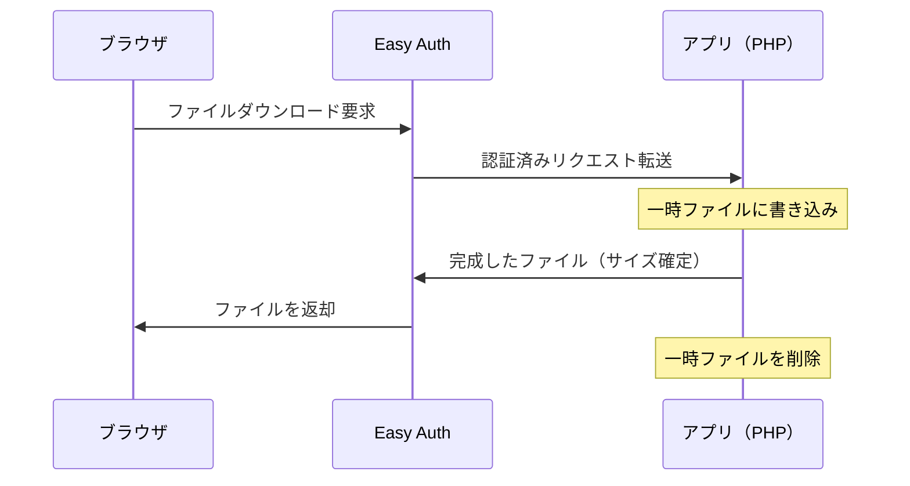

## 発生した問題

Azure App ServiceでEasy Auth（Azure AD認証）を有効にした環境において、PDFやExcelファイルのダウンロード機能でHTTP 502エラーが発生した。

```
このページは動作していません
example.com では現在このリクエストを処理できません。
HTTP ERROR 502
```

不思議なことに、ローカル開発環境では正常に動作するが、Azure上にデプロイすると動かない。Easy Authを有効にしてから発生するようになった。

## 環境

- Azure App Service（Linux）
- Azure Easy Auth（Azure AD認証）有効
- Laravel アプリケーション
- TCPDF/FPDI によるPDF生成、PhpSpreadsheetによるExcel生成

## 原因

Azure Easy Authは、すべてのHTTPリクエスト/レスポンスを仲介するミドルウェアとして動作する。[公式ドキュメント](https://learn.microsoft.com/en-us/azure/app-service/overview-authentication-authorization)によると、Linux環境では専用コンテナで独立して実行され、Ambassadorパターンを使用して受信トラフィックと相互作用する。この構成においてレスポンスのバッファリングが発生する場合がある。

### 通常の通信フロー

Easy Authが無効な場合、ブラウザとアプリが直接通信する。



### Easy Auth有効時の通信フロー

Easy Authが有効な場合、通信が間に入る。



### なぜエラーが発生するのか

問題のあったコードはStreamedResponseやバイナリを直接返す方式を使用していた。

```php
// PDFの場合：バイナリを直接レスポンスとして返す
$pdfBinary = $pdfExportRepository();

return response($pdfBinary)
    ->header('Content-Type', 'application/pdf')
    ->header('Content-Disposition', 'attachment; filename="' . $filename . '"');
```

```php
// Excelの場合：StreamedResponseで少しずつ送る
return new StreamedResponse(function () use ($writer) {
    $writer->save('php://output');
});
```

これらの方式では、以下の問題が発生する。

1. Easy Authは全データが届いてから転送しようとする（バッファリング）
2. アプリは少しずつデータを送り続ける、またはバイナリを直接送信する
3. Easy Authがタイムアウトする
4. 502エラーが発生する

手紙を1枚ずつ渡そうとしているのに、受け取る側が「全部揃ってから受け取ります」と言っているような状態である。

## 解決策

一時ファイルに書き出してから`response()->download()`で送信する方式に変更する。

### 修正後のコード（PDF）

```php
// PDFのバイナリデータを取得
$pdfBinary = $pdfExportRepository();

// 一時ファイルに書き込み
$tempFile = tempnam(sys_get_temp_dir(), 'pdf_');
file_put_contents($tempFile, $pdfBinary);

// ファイル名を生成
$filename = sprintf(
    'document_%s.pdf',
    now()->format('Y-m-d_H-i-s')
);

return response()->download($tempFile, $filename, [
    'Content-Type' => 'application/pdf',
])->deleteFileAfterSend(true);
```

### 修正後のコード（Excel）

```php
// 一時ファイルを作成
$tempFile = tempnam(sys_get_temp_dir(), 'export_');

// ファイルに保存
$writer->save($tempFile);

return response()->download($tempFile, $filename)
    ->deleteFileAfterSend(true);
```

### なぜ解決できるのか

1. `response()->download()`はSymfonyの`BinaryFileResponse`を使用する
2. `BinaryFileResponse`はファイルシステムから直接ストリーミングで送信する
3. ファイルサイズが確定しているため、Easy Authも正しく処理できる
4. `deleteFileAfterSend(true)`により、送信完了後に一時ファイルが自動削除される



## StreamedResponseが有効なケースと避けるべきケース

### 有効なケース

StreamedResponseは「データを生成しながら、できた部分から順次送信する」方式である。以下のケースで有効。

- 巨大ファイルのダウンロード（数GBのログファイル、大量データのCSVエクスポート）
- リアルタイムデータ配信（チャット、株価のリアルタイム更新）
- 動画・音声ストリーミング
- サーバー送信イベント（SSE）

### 避けるべきケース

- プロキシ経由の環境（今回の問題のようにバッファリングと競合する）
- 小〜中規模のファイル（ストリーミングするメリットがない）
- Content-Lengthが必要な場合（ストリーミングではファイルサイズが事前に分からない）

今回のケースでは、エクスポート対象のデータ量が数百〜数千件程度であり、StreamedResponseのメリットがなく、BinaryFileResponseが適切であった。

## まとめ

Azure Easy Auth環境でファイルダウンロード時に502エラーが発生する場合、StreamedResponseやバイナリ直接返却ではなく、一時ファイル経由の`response()->download()`を使用する。この方式はEasy Authのバッファリング処理と互換性があり、問題を解決できる。

ローカル環境では動作するがAzure環境で動作しない場合、Easy Authのプロキシ処理との相性を疑うとよい。

## 参考

- [Authentication and Authorization - Azure App Service | Microsoft Learn](https://learn.microsoft.com/en-us/azure/app-service/overview-authentication-authorization)
- [Issues with Streaming File Response from Azure App Service - Microsoft Q&A](https://learn.microsoft.com/en-us/answers/questions/2150156/issues-with-streaming-file-response-from-azure-app)
- [File Downloads - Laravel Documentation](https://laravel.com/docs/responses#file-downloads)
