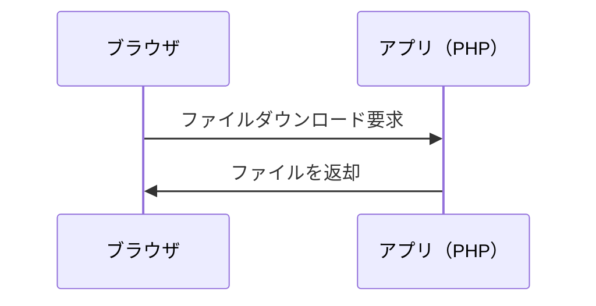
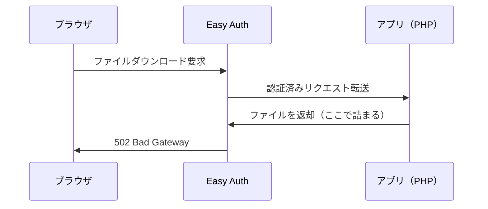
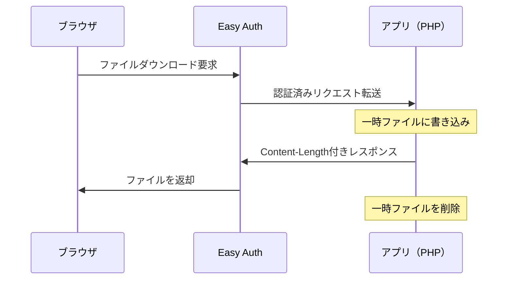

## 発生した問題

Azure App ServiceでEasy Auth（Microsoft Entra ID認証）を有効にした環境において、Excelファイルのダウンロード機能でHTTP 502エラーが発生した。

```
このページは動作していません
example.com では現在このリクエストを処理できません。
HTTP ERROR 502
```

不思議なことに、ローカル開発環境では正常に動作するが、Azure上にデプロイすると動かない。Easy Authを有効にしてから発生するようになった。

## 環境

- Azure App Service（Linux）
- Azure Easy Auth（Microsoft Entra ID認証）有効
- Laravel アプリケーション
- PhpSpreadsheetによるExcel生成

## 原因

Azure Easy Authは、すべてのHTTPリクエスト/レスポンスを仲介するミドルウェアとして動作する。[公式ドキュメント](https://learn.microsoft.com/en-us/azure/app-service/overview-authentication-authorization)によると、Linux環境では専用コンテナで独立して実行され、Ambassadorパターン（メインのアプリケーションコンテナの前段でリクエストを受け付けるサイドカー構成）を使用して受信トラフィックと相互作用する。この構成においてレスポンスのバッファリングが発生する場合がある。

### 通常の通信フロー

Easy Authが無効な場合、ブラウザとアプリが直接通信する。



### Easy Auth有効時の通信フロー

Easy Authが有効な場合、通信が間に入る。



### なぜエラーが発生するのか

問題のあったコードはStreamedResponseを使用していた。

```php
return new StreamedResponse(function () use ($writer) {
    $writer->save('php://output');
});
```

この方式では、以下の問題が発生する。

1. Easy Authは全データが届いてから転送しようとする（バッファリング）
2. アプリは少しずつデータを送り続ける
3. Easy Authがタイムアウトする
4. 502エラーが発生する

手紙を1枚ずつ渡そうとしているのに、受け取る側が「全部揃ってから受け取ります」と言っているような状態である。

## 解決策

一時ファイルに書き出してから`response()->download()`で送信する方式に変更する。

```php
// 一時ファイルを作成
$tempFile = tempnam(sys_get_temp_dir(), 'export_');

// ファイルに保存
$writer->save($tempFile);

return response()->download($tempFile, $filename)
    ->deleteFileAfterSend(true);
```

### なぜ解決できるのか

本質的には、Content-Lengthヘッダーが適切に設定されることが重要である。

| 方式 | Content-Length | 送信方式 |
|------|----------------|----------|
| StreamedResponse | 設定されない | chunked transfer encoding |
| `response()->download()` | ファイルサイズから自動設定 | ファイルシステムから直接送信 |

`response()->download()`（BinaryFileResponse）を使用すると、以下の理由で問題が解決する。

1. ファイルのメタデータからContent-Lengthヘッダーを自動設定する
2. プロキシやミドルウェアがレスポンスサイズを事前に把握できる
3. X-Sendfile等のサーバー最適化機能を利用できる場合がある
4. `deleteFileAfterSend(true)`により、送信完了後に一時ファイルが自動削除される

StreamedResponseはContent-Lengthを設定せず、chunked transfer encodingでデータを少しずつ送信する。
この方式はプロキシ環境でバッファリングの問題を引き起こす可能性がある。



## StreamedResponseが有効なケースと避けるべきケース

### 有効なケース

StreamedResponseは「データを生成しながら、できた部分から順次送信する」方式である。以下のケースで有効。

- 巨大ファイルのダウンロード（数GBのログファイル、大量データのCSVエクスポート）
- リアルタイムデータ配信（チャット、株価のリアルタイム更新）
- 動画・音声ストリーミング
- サーバー送信イベント（SSE）

### 注意するべきケース

- プロキシ経由の環境（今回の問題のようにバッファリングと競合する）
- 小〜中規模のファイル（ストリーミングするメリットがない）
- Content-Lengthが必要な場合（ストリーミングではファイルサイズが事前に分からない）

今回のケースでは、エクスポート対象のデータ量が数百〜数千件程度であり、StreamedResponseのメリットがなく、BinaryFileResponseが適切であった。

## まとめ

Azure Easy Auth環境でファイルダウンロード時に502エラーが発生する場合、StreamedResponseではなく、一時ファイル経由の`response()->download()`を使用する。この方式はEasy Authのバッファリング処理と互換性があり、問題を解決できる。

ローカル環境では動作するがAzure環境で動作しない場合、Easy Authのプロキシ処理との相性を疑うとよい。

## 参考

- [Authentication and Authorization - Azure App Service | Microsoft Learn](https://learn.microsoft.com/en-us/azure/app-service/overview-authentication-authorization)
- [Issues with Streaming File Response from Azure App Service - Microsoft Q&A](https://learn.microsoft.com/en-us/answers/questions/2150156/issues-with-streaming-file-response-from-azure-app)
- [File Downloads - Laravel Documentation](https://laravel.com/docs/responses#file-downloads)
