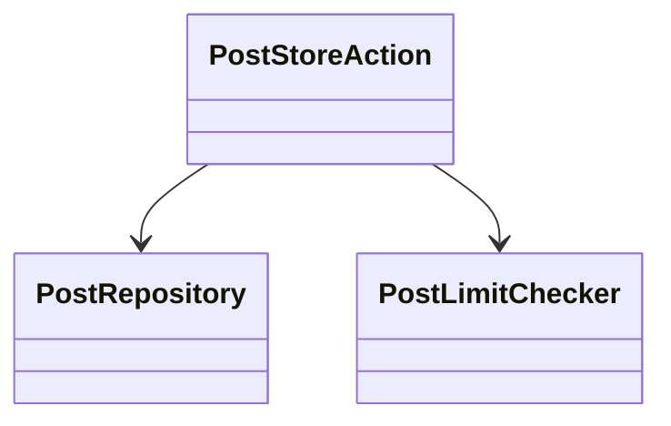
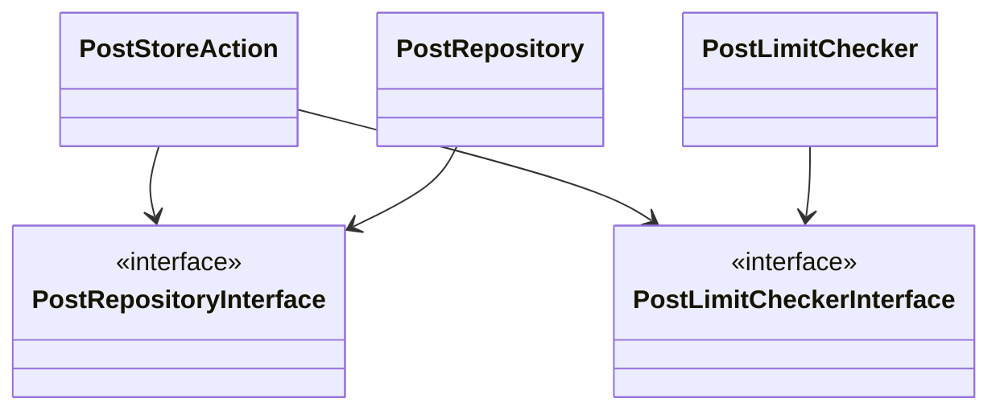

## IoCコンテナについて
Laravelのサービスコンテナを理解するためには、まずIoC（Inversion of Control）コンテナについて理解することが重要です。IoCコンテナは、クラスの依存関係を柔軟に管理する役割を果たしています。

「制御の反転」を意味するIoCは、設計原則の一つであり、モジュール間の疎結合を促進することを目的としています。この記事では、「モジュール」を個々のクラスやコンポーネントとして取り扱います。これにより、各クラスは独立して動作可能となり、テストや再利用が容易になります。

### IoCとDI
IoCの原則を実現する一つの手法として、DI（Dependency Injection）があります。
DIはクラスが自身の依存オブジェクトを直接生成するのではなく、外部から注入するデザインパターンです。
したがって、IoCコンテナはDIコンテナとも呼ばれます。

### 依存しているコードの例

以下に示す`PostStoreAction`は、`PostRepository`と`PostLimitChecker`に依存しています。
※ コードはサンプルで動作確認はしていません。

```php
<?php

declare(strict_types=1);

namespace Sample\PHP;

use App\Models\Post;
use App\Models\User;
use Sample\PHP\Infrastructure\PostRepository;
use Sample\PHP\Infrastructure\PostLimitChecker;
use Exception;

class PostStoreAction
{
    private $postRepository;
    private $postLimitChecker;

    public function __construct() {
        $this->postRepository = new PostRepository();
        $this->postLimitChecker = new PostLimitChecker();
    }

    public function __invoke(
        User $user,
        Post $post
    ): void
    {
        if ($this->postLimitCheckerAction->isOverLimit($user)) {
            throw new Exception('投稿数の上限を超えています');
        }

        $this->postRepository->save($post);
    }
}
```

`PostStoreAction`には次のような問題があります。
- 依存しているオブジェクトを考慮したテストが必要となり、リポジトリの実装が変更された場合、テストも再作成する必要が生じます。
- 依存しているオブジェクトの実装が変更された場合、それに伴いPostStoreActionにも影響が及ぶ可能性があります。

これらの問題は、IoCコンテナを使用することで解決できます。IoCコンテナを利用すると、依存関係の注入が外部から行われ、クラスの疎結合が促進されます。結果として、テストの容易さが向上し、コードの柔軟性が高まります。

### 疎結合を実現するために
疎結合を実現するためには、どのようなアプローチを取るべきでしょうか？
一つの有効な方法は、依存しているオブジェクト間で共通のインターフェースを定義し、依存関係をインターフェースに向けることです。

従来の依存関係は以下のようになっていました。



これを、次のように変更します。



このアプローチによって、`PostStoreAction`は具体的な`PostRepository`や`PostLimitChecker`の実装ではなく、それらのインターフェースに依存するようになります。

## サービスコンテナについて
前述のIoCコンテナに続いて、Laravelのサービスコンテナについて詳しく説明します。
サービスコンテナはLaravelにおけるIoCコンテナの実装であり、アプリケーションの依存性管理を効率的に行います。

### 依存関係の解決
Laravelのサービスコンテナでは、インターフェースと実装の依存関係を解決するために、`bind`、`singleton`、および`make`を用いることが可能です。
これらのメソッドは、サービスコンテナにおいて異なる役割を果たします。

### bindの使用
`bind`メソッドは、サービスコンテナからインターフェースが解決されるたびに、新しいオブジェクトのインスタンスを生成します。これは、リクエストごとに異なる状態のインスタンスが必要な場合に適しています。

```php
$this->app->bind(
    \App\Contracts\PostRepositoryInterface::class,
    \App\Repositories\Post\EloquentRepository::class
);
```

### singletonの使用
一方、`singleton`メソッドは、最初に解決されたときにのみインスタンスを生成し、その後のすべてのリクエストで同じインスタンスが再利用されます。これは、アプリケーション全体で一貫性のある状態や設定を共有する場合に適しています。

```php
$this->app->singleton(CacheInterface::class, FileCache::class);
```

### makeの使用
`make`メソッドは、サービスコンテナからクラスインスタンスを解決する際に使用されます。これは、アプリケーションの実行時に特定のクラスのインスタンスを生成するために便利です。

```php
$postRepository = app()->make(\App\Contracts\PostRepositoryInterface::class);
```

## 実装例

### インターフェースの実装

まずは`PostRepository`インターフェースの実装を行います。
このインターフェースは、投稿データを保存するためのメソッドを定義します。

```php
<?php

declare(strict_types=1);

namespace App\Models;

use App\Models\Post;

interface PostRepository
{
    public function save(Post $post): void;
}

```

次に投稿数の上限値は、設定情報を提供するサービスから取得するとします。
そのため、投稿数の上限値を提供する設定情報サービスのインターフェースを定義します。

```php
<?php

declare(strict_types=1);

namespace App\Models;

interface ConfigurationService
{
    public function getPostLimit(): int;
}

```

## 実装クラス

`PostRepository`の実装クラスは次のようになります。ここでは、Eloquentを利用して投稿データを保存します。

```php
<?php

declare(strict_types=1);

namespace App\Repositories\Post;

use App\Models\Post;
use App\Models\PostRepository as PostRepositoryInterface;

class EloquentRepository implements PostRepositoryInterface
{
    public function save(Post $post): void
    {
        $post->save();
    }
}
```

`ConfigurationService`の実装は以下の通りです。

```php
<?php

declare(strict_types=1);

namespace App\Services\Configuration;

use App\Models\ConfigurationService as ConfigurationServiceInterface;

class ConfigurationService implements ConfigurationServiceInterface
{
    public function getPostLimit(): int
    {
        return 10;
    }
}
```

`PostLimitCheckerAction`は`ConfigurationService`に依存していますが、インターフェースを使用せず、具体的な実装クラスに直接依存するとします。

```php
<?php

declare(strict_types=1);

namespace App\Service\User;

use App\Models\ConfigurationService;
use App\Models\User;

class PostLimitCheckerAction
{
    public function __construct(
        private ConfigurationService $configurationService
    ) {
    }

    public function isOverLimit(
        User $user,
    ): bool
    {
        return $user->posts->count() > $this->configurationService->getPostLimit();
    }
}

```

依存性の解決は、`AppServiceProvider`の`register`で行うとします。

```php
<?php

namespace App\Providers;

use Illuminate\Support\ServiceProvider;

class AppServiceProvider extends ServiceProvider
{
    /**
     * Register any application services.
     */
    public function register(): void
    {
        $this->app->bind(
            \App\Models\PostRepository::class,
            \App\Repositories\Post\EloquentRepository::class
        );

        $this->app->bind(
            \App\Models\ConfigurationService::class,
            \App\Services\Configuration\ConfigurationService::class
        );

        $this->app->bind(
            \App\Service\Post\PostLimitCheckerAction::class,
            function ($app) {
                return new \App\Service\Post\PostLimitCheckerAction(
                    $app->make(\App\Models\ConfigurationService::class)
                );
            }
        );
    }

    /**
     * Bootstrap any application services.
     */
    public function boot(): void
    {
        //
    }
}

```

着目してほしいのが、`PostLimitCheckerAction`の依存解決です。
`PostLimitCheckerAction`の依存関係解決には、makeメソッドを使用して`ConfigurationService`のインスタンスを取得しています。

### 投稿アクションクラスとコントローラー

`PostStoreAction`クラスは、投稿データの保存と投稿数の上限チェックを行います。

```php
<?php

declare(strict_types=1);

namespace App\Service\Post;

use App\Models\Post;
use App\Models\User;
use App\Models\PostRepository;
use App\Service\Post\PostLimitCheckerAction;
use Exception;

class PostStoreAction
{
    public function __construct(
        private PostRepository $postRepository,
        private PostLimitCheckerAction $postLimitCheckerAction
    ) {
    }

    public function __invoke(
        User $user,
        Post $post,
    ): void
    {
        if ($this->postLimitCheckerAction->isOverLimit($user)) {
            throw new Exception('投稿数の上限を超えています');
        }

        $this->postRepository->save($post);
    }
}
```

コントローラーでは、次のように呼び出すことが可能になります。

```php
<?php

namespace App\Http\Controllers\Api\Post;

use App\Http\Controllers\Controller;
use Illuminate\Http\Request;

class StoreController extends Controller
{
    public function __invoke(
        Request $request,
        \App\Service\Post\PostStoreAction $postStoreAction
    ): \Illuminate\Http\JsonResponse
    {
        // コントローラーの実装...
    }
}
```

## まとめ
この記事では、Laravelの依存性管理の核とサービスコンテナについて掘り下げました。IoCコンテナとDI（依存性注入）の基本原則から始め、疎結合を実現する方法について解説しました。

具体的な実装例を通じて、インターフェースの実装方法や、投稿アクションクラスとコントローラーの実際の使用法を見てきました。これにより、実際のアプリケーション開発においてLaravelのサービスコンテナをどのように活用できるかの理解を深めることに役立てていただけると嬉しいです。
