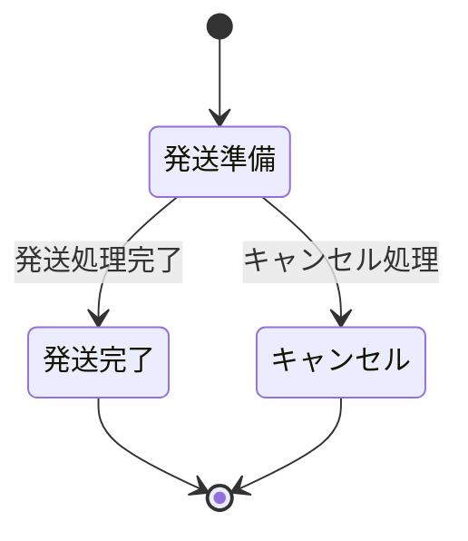

## 導入
ブラックボックステスト技法とは、テスト対象の内部構造ではなく、入出力（外から見た振る舞い）に着目するテスト技法を指します。
それをPHP Unitで実際にコードを書いて解説していきます。

今回は注文商品を例としていきます。

はじめに例で参照するサンプルの注文商品クラスのコードを載せておきます。

```php
<?php
declare(strict_types=1);

namespace App\Domain;

use DateTimeImmutable;
use Exception;

class Order
{
    public function __construct(
        private int $id,
        private string $name,
        private string $description,
        private float $price,
        private int $quantity,
        private string $status,
        private DateTimeImmutable $orderDate,
    ) {}

    /**
     * 注文日から3日以内であればキャンセルが可能
     *
     * @param DateTimeImmutable $now
     * @return bool
     */
    public function isCancelable(
        DateTimeImmutable $now
    ): bool
    {
        // 注文日より前の日付はキャンセル不可
        if ($now < $this->orderDate) {
            return false;
        }

        $interval = $now->diff($this->orderDate);
        return $interval->days <= 3;
    }

    /**
     * 注文料金を計算する
     *
     * @param array<string, DateTimeImmutable> $campaignPeriod
     */
    public function calculatePrice(
        array $campaignPeriod
    ): int
    {
        $price = $this->price * $this->quantity;

        // キャンペーン期間中は10%割引
        if ($campaignPeriod['start'] <= $this->orderDate && $this->orderDate <= $campaignPeriod['end']) {
            $price = $price * 0.9;
        }

        // 限定商品は20%割引
        if ($this->isLimited()) {
            $price = $price * 0.8;
        }

        // 注文数が10以上なら5%割引
        if ($this->quantity >= 10) {
            $price = $price * 0.95;
        }

        // 端数は切り捨て
        return (int)floor($price);
    }

    /**
     * 限定商品かどうかを判定する
     */
    private function isLimited(): bool
    {
        // 限定商品の判定ロジック
        if ($this->name === '限定商品') {
            return true;
        }

        return true;
    }

    /**
     * キャンセル処理
     */
    public function cancel(): Order
    {
        // 発送準備中以外はキャンセル不可
        if ($this->status !== 'shipping_ready') {
            throw new Exception('キャンセル不可');
        }

        // キャンセル処理
        return new Order(
            $this->id,
            $this->name,
            $this->description,
            $this->price,
            $this->quantity,
            'canceled',
            $this->orderDate,
        );
    }

    /**
     * 発送処理
     */
    public function ship(): Order
    {
        // 発送準備中以外は発送不可
        if ($this->status !== 'shipping_ready') {
            throw new Exception('発送不可');
        }

        // 発送処理
        return new Order(
            $this->id,
            $this->name,
            $this->description,
            $this->price,
            $this->quantity,
            'shipped',
            $this->orderDate,
        );
    }

    /**
     * キャンセル済みかどうかを判定する
     */
    public function isCanceled(): bool
    {
        return $this->status === 'canceled';
    }

    /**
     * 発送済みかどうかを判定する
     */
    public function isShipped(): bool
    {
        return $this->status === 'shipped';
    }
}

```

## 同値分割法(Equivalence Partitioning)
同値分割法とは、入力を代表する値のグループに分けてテストをする技法です。
例えば、注文日から3日以内であればキャンセルできるか判断する関数があるとします。

```php
    /**
     * 注文日から3日以内であればキャンセルが可能
     *
     * @param DateTimeImmutable $now
     * @return bool
     */
    public function isCancelable(
        DateTimeImmutable $now
    ): bool
    {
        // 注文日より前の日付はキャンセル不可
        if ($now < $this->orderDate) {
            return false;
        }

        $interval = $now->diff($this->orderDate);
        return $interval->days <= 3;
    }
```

この場合は、入力値を次の3つにグループを区別して、その代表値を適当に抽出しテストするとします。
1. 注文日より前 (キャンセル不可)
2. 注文日から3日以内 (キャンセル可能)
3. 注文日から3日以降 (キャンセル不可)

:::message
グループ分けの判断や代表値の選び方は、前段のテスト分析やテスト設計で決定することが多いため、ここでは説明を省略します。
:::

```php

    /**
     * 3日以内の注文はキャンセル可能
     */
    public function testIsCancelableWithin3Days()
    {
        $order = new Order(
            1,
            'PHP Book',
            'PHP Book',
            1000,
            1,
            'shipping_ready',
            new DateTimeImmutable('2024-01-01')
        );

        $this->assertTrue($order->isCancelable(new DateTimeImmutable('2024-01-02')));
    }

    /**
     * 3日以降の注文はキャンセル不可
     */
    public function testIsCancelableAfter3Days()
    {
        $order = new Order(
            1,
            'PHP Book',
            'PHP Book',
            1000,
            1,
            'shipping_ready',
            new DateTimeImmutable('2024-01-01')
        );

        $this->assertFalse($order->isCancelable(new DateTimeImmutable('2024-02-01')));
    }

    /**
     * 注文日より前の日付はキャンセル不可
     */
    public function testIsCancelableBeforeOrderDate()
    {
        $order = new Order(
            1,
            'PHP Book',
            'PHP Book',
            1000,
            1,
            'shipping_ready',
            new DateTimeImmutable('2024-01-01')
        );

        $this->assertFalse($order->isCancelable(new DateTimeImmutable('2023-12-31')));
    }

```

それぞれのグループから1つの値をテストすれば、他のグループに属する値も同等に処理されると考えられます。
有効な値を含むグループと無効な値を含むグループに区別することが大事です。
これにより全ての値をテストせずに済むため、効率的にテストを行うことができるようになります。
同値分割法は、入力値の組み合わせがなく、入力値をグループ分けが可能な場合に有効です。

## 境界値分析(Boundary Value Analysis)
境界値分析とは、入力値の範囲の境界付近に注目したテスト技法です。
境界値分析を注文キャンセルの判断に適用する場合、注目すべき境界は、「注文日」と「注文日から3日目」です。
この境界を基点に、次の3つの観点からテストします。
- その直前
- 境界値
- 直後

このアプローチにより、境界値の周辺での関数の挙動を正確に評価することができます。
以下にテストコードを示します。

```php

    /**
     * 注文日の前日はキャンセル不可
     */
    public function testIsCancelableBeforeOrderDate()
    {
        $order = new Order(
            1,
            'PHP Book',
            'PHP Book',
            1000,
            1,
            new DateTimeImmutable('2024-01-01')
        );

        $this->assertFalse($order->isCancelable(new DateTimeImmutable('2023-12-31')));
    }

    /**
     * 注文日当日はキャンセル可能
     */
    public function testIsCancelableOnOrderDate()
    {
        $order = new Order(
            1,
            'PHP Book',
            'PHP Book',
            1000,
            1,
            new DateTimeImmutable('2024-01-01')
        );

        $this->assertTrue($order->isCancelable(new DateTimeImmutable('2024-01-01')));
    }

    /**
     * 注文日の翌日はキャンセル可能
     */
    public function testIsCancelableAfterOrderDate()
    {
        $order = new Order(
            1,
            'PHP Book',
            'PHP Book',
            1000,
            1,
            new DateTimeImmutable('2024-01-01')
        );

        $this->assertTrue($order->isCancelable(new DateTimeImmutable('2024-01-02')));
    }

    /**
     * 注文日から3日後の1日前はキャンセル可能
     */
    public function testIsCancelableBefore3Days()
    {
        $order = new Order(
            1,
            'PHP Book',
            'PHP Book',
            1000,
            1,
            new DateTimeImmutable('2024-01-01')
        );

        $this->assertTrue($order->isCancelable(new DateTimeImmutable('2024-01-03')));
    }

    /**
     * 注文日から3日後の当日はキャンセル可能
     */
    public function testIsCancelableOn3Days()
    {
        $order = new Order(
            1,
            'PHP Book',
            'PHP Book',
            1000,
            1,
            new DateTimeImmutable('2024-01-01')
        );

        $this->assertTrue($order->isCancelable(new DateTimeImmutable('2024-01-04')));
    }

    /**
     * 注文日から3日後の1日後はキャンセル不可
     */
    public function testIsCancelableAfter3Days()
    {
        $order = new Order(
            1,
            'PHP Book',
            'PHP Book',
            1000,
            1,
            new DateTimeImmutable('2024-01-01')
        );

        $this->assertFalse($order->isCancelable(new DateTimeImmutable('2024-01-05')));
    }

```

テストの件数は多くなりますが、比較的問題が発生しがちな境界値付近が正常に動作しているかを評価することができます。

## デシジョンテーブル(Decision Table)
デシジョンテーブルとは、入力値の組み合わせとその期待結果を整理してテストするテスト技法です。
今回は次のようなデシジョンテーブルを作成しました。

| 注文日の状態     | 商品名     | 注文量    | 注文料金計算                                |
|----------------|------------|----------|-------------------------------------------|
| キャンペーン期間中 | 一般商品    | 10個未満  | 基本価格 - キャンペーン割引                      |
| キャンペーン期間中 | 一般商品    | 10個以上  | 基本価格 - キャンペーン割引 - 大量注文割引            |
| キャンペーン期間中 | 限定商品    | 10個未満  | 基本価格 - 限定商品割引 - キャンペーン割引            |
| キャンペーン期間中 | 限定商品    | 10個以上  | 基本価格 - 限定商品割引 - キャンペーン割引 - 大量注文割引  |
| キャンペーン期間外 | 一般商品    | 10個未満  | 基本価格                                      |
| キャンペーン期間外 | 一般商品    | 10個以上  | 基本価格 - 大量注文割引                            |
| キャンペーン期間外 | 限定商品    | 10個未満  | 基本価格 - 限定商品割引                            |
| キャンペーン期間外 | 限定商品    | 10個以上  | 基本価格 - 限定商品割引 - 大量注文割引                  |

注文金額計算メソッドを次のようにしました。
```php
    /**
     * 注文料金を計算する
     *
     * @param array<string, DateTimeImmutable> $campaignPeriod
     */
    public function calculatePrice(
        array $campaignPeriod
    ): int
    {
        $price = $this->price * $this->quantity;

        // キャンペーン期間中は10%割引
        if ($campaignPeriod['start'] <= $this->orderDate && $this->orderDate <= $campaignPeriod['end']) {
            $price = $price * 0.9;
        }

        // 限定商品は20%割引
        if ($this->isLimited()) {
            $price = $price * 0.8;
        }

        // 注文数が10以上なら5%割引
        if ($this->quantity >= 10) {
            $price = $price * 0.95;
        }

        // 端数は切り捨て
        return (int)floor($price);
    }
```

全てのテストコードを書くと長くなるので、割愛しますが次のようなテストコードになると思います。
複数の入力条件の組み合わせがある場合は、私の場合は視認性を考慮して日本語でテストを書いてしまうことが多いです。

```php
    /**
     * キャンペーン期間中かつ、限定商品かつ、10個以上注文の場合
     */
    public function test_キャンペーン期間中かつ限定商品かつ10個以上注文の場合()
    {
        $order = new Order(
            1,
            '限定商品',
            '限定商品',
            1000,
            10,
            new DateTimeImmutable('2024-01-01')
        );

        $campaignPeriod = [
            'start' => new DateTimeImmutable('2023-12-31'),
            'end' => new DateTimeImmutable('2024-01-02'),
        ];

        $this->assertSame(6840, $order->calculatePrice($campaignPeriod));
    }
```

デシジョンテーブルを作成することで、考慮漏れや重複を防ぎながら、網羅的にテストすることが可能です。
複雑なビジネスルールがある場合に特に有効です。

## 状態遷移テスト(State Transition Testing)

状態遷移テストとは、ソフトウェアの状態の遷移を遷移図で整理し、状態遷移を網羅してテストするテスト技法です。
テスト対象の状態の変化に注目して、テストを行いたい場合に有効です。



この状態遷移図は、注文商品のライフサイクルを示しています。

- 発送準備：この状態は、注文が確定し、商品が発送の準備段階にあることを意味します。初期状態からこの状態に遷移します。
- 発送完了：商品の発送準備が完了し、実際に発送された状態です。ここからは他の状態への遷移は発生しません。
- キャンセル：注文がキャンセルされた状態です。こちらも発送完了と同様に、他の状態への遷移はありません。


次のメソッドを定義します。

```php
    /**
     * キャンセル処理
     */
    public function cancel(): Order
    {
        // 発送準備中以外はキャンセル不可
        if ($this->status !== 'shipping_ready') {
            throw new Exception('キャンセル不可');
        }

        // キャンセル処理
        return new Order(
            $this->id,
            $this->name,
            $this->description,
            $this->price,
            $this->quantity,
            'canceled',
            $this->orderDate,
        );
    }

    /**
     * 発送処理
     */
    public function ship(): Order
    {
        // 発送準備中以外は発送不可
        if ($this->status !== 'shipping_ready') {
            throw new Exception('発送不可');
        }

        // 発送処理
        return new Order(
            $this->id,
            $this->name,
            $this->description,
            $this->price,
            $this->quantity,
            'shipped',
            $this->orderDate,
        );
    }

```

そして、次のようなテストを作成しました。

```php
    /**
     * キャンセル処理
     */
    public function testCancel()
    {
        $order = new Order(
            1,
            'PHP Book',
            'PHP Book',
            1000,
            1,
            'shipping_ready',
            new DateTimeImmutable('2024-01-01')
        );

        $canceledOrder = $order->cancel();

        $this->assertTrue($canceledOrder->isCanceled());
    }

    /**
     * 出荷処理
     */
    public function testShip()
    {
        $order = new Order(
            1,
            'PHP Book',
            'PHP Book',
            1000,
            1,
            'shipping_ready',
            new DateTimeImmutable('2024-01-01')
        );

        $shippedOrder = $order->ship();

        $this->assertTrue($shippedOrder->isShipped());
    }

    /**
     * 出荷済みの場合は出荷処理不可
     */
    public function testShipWhenAlreadyShipped()
    {
        $order = new Order(
            1,
            'PHP Book',
            'PHP Book',
            1000,
            1,
            'shipped',
            new DateTimeImmutable('2024-01-01')
        );

        $this->expectException(Exception::class);
        $order->ship();
    }

    /**
     * キャンセル済みの場合は出荷処理不可
     */
    public function testShipWhenAlreadyCanceled()
    {
        $order = new Order(
            1,
            'PHP Book',
            'PHP Book',
            1000,
            1,
            'canceled',
            new DateTimeImmutable('2024-01-01')
        );

        $this->expectException(Exception::class);
        $order->ship();
    }
```

この状態遷移図に基づいてテストケースを設計する際には、各状態と遷移を適切にカバーするようにします。また、発送準備状態から発送完了やキャンセル状態への遷移が正しく行われるか、また、発送完了やキャンセル状態から他の状態への遷移が不可能であることを検証することが重要になってきます。

## まとめ
この記事では、PHPUnitを用いたブラックボックステスト技法に焦点を当て、具体的な注文商品クラスを例に挙げながら、同値分割法、境界値分析、デシジョンテーブル、状態遷移テストという異なるテスト手法を解説しました。

- 同値分割法は、異なる入力値を代表するグループに分けて効率的にテストします。
- 境界値分析は、入力値の境界付近に焦点を当て、バグの発生しやすい箇所を特定します。
- デシジョンテーブルは、複数の入力値とそれらの期待される出力を整理し、複雑なビジネスルールのテストに適しています。
- 状態遷移テストは、システムの状態遷移に着目し、状態間の動作を正確に捉えるために役立ちます。

これらのテスト技法を駆使することで、効率的にテストを行うことが可能になり、システムの品質向上につながると思います。
また、他にも様々なテスト技法があ流と思いますので、ぜひ調べてみてください。
