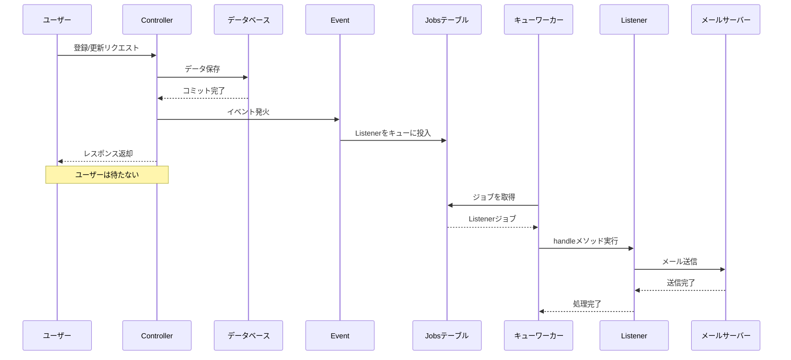
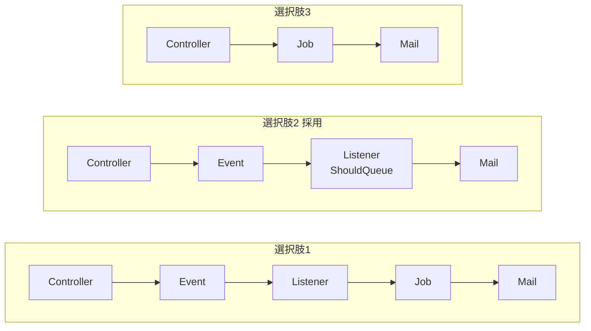
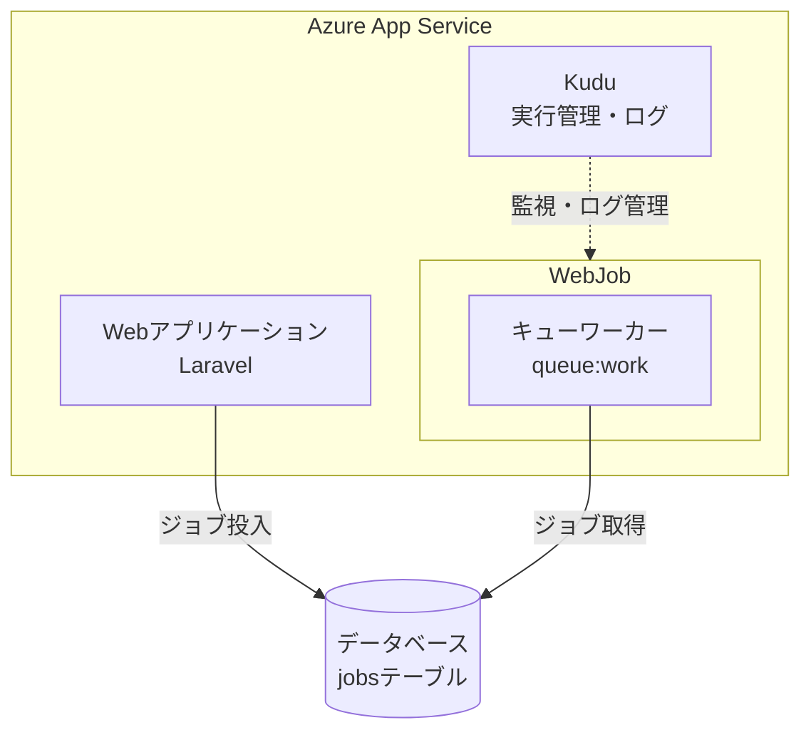
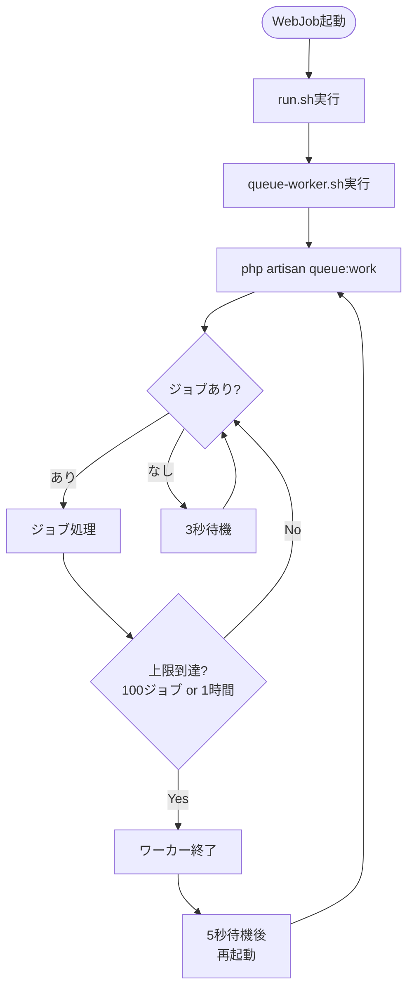

# Azure App ServiceでLaravelキューワーカーを使ったメール送信の実装

## はじめに

本記事では、Azure App Service上でLaravelのキューワーカーを使い、非同期でメール送信を行う実装について解説する。

メール送信のような外部サービスとの通信は、同期処理で行うとユーザーを待たせてしまう。そのため、キューを使った非同期処理が望ましい。Laravelにはキューの仕組みが標準で備わっており、Azure App ServiceのWebJob機能と組み合わせることで、追加のインフラを用意することなく非同期処理を実現できる。

## 技術スタック

今回の実装で使用した技術スタックは以下の通りである。

- Azure App Service（Linux）
- Laravel 12
- PHP 8.4
- データベースキュードライバ（SQL Server）

Laravelのキュードライバとしてdatabaseを採用した理由は、Redisなどの追加インフラが不要であり、既存のデータベースをそのまま利用できるためである。

## アーキテクチャ設計

### 処理フロー

今回採用した処理フローは以下の構成である。



ユーザーが登録または更新すると、Controllerがデータベースへの保存を完了した後にEventを発火する。通常、ListenerのhandleメソッドはEvent発火時に即座に実行されるが、ListenerにShouldQueueインターフェースを実装すると動作が変わる。handleメソッドを即座に実行する代わりに、「このListenerをこのデータで後で実行する」という情報がデータベースの `jobs` テーブルにレコードとして保存される。これが「キューに投入される」ということである。レコードの保存だけで済むため、Controllerはすぐにレスポンスを返せる。

その後、別プロセスとして常駐しているキューワーカー（`php artisan queue:work`）が `jobs` テーブルを定期的にポーリングし、レコードを見つけるとhandleメソッドを実行してメールを送信する。

### なぜこの構成を選んだか

Laravelでメール送信を非同期化する方法はいくつかある。ADR（Architecture Decision Record）で検討した選択肢は以下の4つであった。



1. Event → Listener → Job → Mail
2. Event → Queueable Listener → Mail
3. Controller → Job 直接

選択肢1は最も疎結合だが、クラス数が多くなりオーバーエンジニアリングになる懸念があった。選択肢3はシンプルだが、Controllerに処理が集中し拡張性が低い。

最終的に選択肢2の「Event → Queueable Listener → Mail」を採用した。Jobクラスを省略しつつ、Event/Listenerによる疎結合を維持できる点が決め手となった。将来的に通知以外の処理（ログ記録、外部API連携など）を追加する場合も、新しいListenerを追加するだけで対応できる。

## Laravelの実装解説

### マイグレーションの準備

databaseキュードライバを使用するには、ジョブを保持するテーブルのマイグレーションが必要である。以下のコマンドでマイグレーションファイルを生成し、実行する。

```bash
php artisan make:queue-table
php artisan make:queue-failed-table
php artisan migrate
```

これにより `jobs` テーブルと `failed_jobs` テーブルが作成される。`jobs` テーブルはキューに投入されたジョブを保持し、`failed_jobs` テーブルはすべてのリトライが失敗したジョブを記録する。

### Eventクラスの作成

Eventクラスはシンプルな構造である。Inquiryモデルをコンストラクタで受け取り、SerializesModelsトレイトを使ってキューにシリアライズできるようにする。

```php
<?php

declare(strict_types=1);

namespace App\Events\Inquiry;

use App\Models\Inquiry;
use Illuminate\Foundation\Events\Dispatchable;
use Illuminate\Queue\SerializesModels;

class InquiryCreated
{
    use Dispatchable;
    use SerializesModels;

    public function __construct(
        public readonly Inquiry $inquiry
    ) {}
}
```

InquiryUpdatedも同様の構造で作成した。

### Listenerクラスの作成

ListenerにShouldQueueインターフェースを実装することで、handleメソッドの処理が自動的にキューに投入される。これがQueueable Listenerパターンの特徴である。

```php
<?php

declare(strict_types=1);

namespace App\Listeners\Inquiry;

use App\Events\Inquiry\InquiryCreated;
use App\Mail\Inquiry\InquiryCreatedMail;
use Illuminate\Contracts\Queue\ShouldQueue;
use Illuminate\Support\Facades\Log;
use Illuminate\Support\Facades\Mail;
use Throwable;

class SendInquiryCreatedNotification implements ShouldQueue
{
    public $queue = 'default';
    public int $tries = 3;
    public int $timeout = 60;
    public bool $afterCommit = true;

    public function handle(InquiryCreated $event): void
    {
        $emails = config('inquiry.notification.emails');

        if (empty($emails)) {
            Log::info('問い合わせ登録通知の通知先メールアドレスが設定されていません', [
                'inquiry_id' => $event->inquiry->id,
            ]);
            return;
        }

        $event->inquiry->loadMissing('category');

        foreach ($emails as $email) {
            Mail::to($email)->send(new InquiryCreatedMail($event->inquiry));
            Log::info('問い合わせ登録通知のメール送信完了', [
                'inquiry_id' => $event->inquiry->id,
                'inquiry_number' => $event->inquiry->inquiry_number,
                'to' => $email,
            ]);
        }
    }

    public function failed(InquiryCreated $event, Throwable $exception): void
    {
        Log::error('問い合わせ登録通知のメール送信失敗', [
            'inquiry_id' => $event->inquiry->id,
            'inquiry_number' => $event->inquiry->inquiry_number,
            'error' => $exception->getMessage(),
        ]);
    }
}
```

$triesプロパティで最大リトライ回数、$timeoutプロパティでタイムアウト秒数を指定できる。failedメソッドを定義しておくと、すべてのリトライが失敗した場合に呼び出される。

`$afterCommit = true` を設定すると、データベーストランザクションのコミット後にのみキューへジョブが投入される。これにより、トランザクションがロールバックされた場合にジョブが投入されることを防げる。

### Mailableクラスの作成

Mailableクラスではメールの件名、テンプレート、データを定義する。

```php
<?php

declare(strict_types=1);

namespace App\Mail\Inquiry;

use App\Models\Inquiry;
use Illuminate\Mail\Mailable;
use Illuminate\Mail\Mailables\Content;
use Illuminate\Mail\Mailables\Envelope;

class InquiryCreatedMail extends Mailable
{
    public function __construct(
        public readonly Inquiry $inquiry
    ) {}

    public function envelope(): Envelope
    {
        return new Envelope(
            subject: '【問い合わせ管理システム】問い合わせが登録されました',
        );
    }

    public function content(): Content
    {
        return new Content(
            view: 'mail.inquiry.created',
            with: [
                'inquiry' => $this->inquiry,
            ],
        );
    }
}
```

### イベントの発火

Controllerでデータベースへのコミットが完了した後にイベントを発火する。コミット前に発火すると、ロールバック時にメールだけ送信されてしまう可能性があるため、この順序は重要である。

```php
DB::commit();

event(new \App\Events\Inquiry\InquiryCreated($inquiry));

return new JsonResponse([
    'inquiryId' => $inquiry->id,
    'message' => 'Success',
], 200);
```

なお、前述の通りListenerに `$afterCommit = true` を設定しておけば、トランザクション内でイベントを発火してもコミット後にジョブが投入される。手動で `DB::commit()` の後にイベントを発火する方法と `$afterCommit` プロパティを使う方法のどちらでも実現可能だが、`$afterCommit` の方がトランザクション管理とイベント発火の順序を意識せずに済むため安全である。

### イベントとリスナーの紐付け

Laravel 12ではイベントリスナーの自動ディスカバリーがデフォルトで有効になっている。app/Listenersディレクトリに配置したListenerは、handleメソッドの型宣言から自動的にEventと紐付けられる。そのため、EventServiceProviderでの明示的な登録は不要である。

## WebJobとは

WebJobはAzure App Serviceの機能で、Webアプリケーションと同じ環境内でバックグラウンド処理を実行できる。追加のインフラを用意する必要がなく、Kuduによって実行やログ管理が行われる。



WebJobには主に3つの種類がある。

- Triggered WebJobは手動起動や外部からのAPI呼び出しで動作する
- Scheduled WebJobはTriggered WebJobの一種で、NCRONTAB式でスケジュール実行される
- Continuous WebJobは常駐型で動き続ける

今回はContinuous WebJobを採用した。メール通知の即時性を重視し、ジョブ投入後すぐに処理されることを優先したためである。ただし、Continuous WebJobを使用するにはApp ServiceのAlways Onを有効化する必要があり、Basic以上のプランが必要となる。

## キューワーカーの設定

### ディレクトリ構造

WebJobはApp Serviceの特定のディレクトリ配下で検出される。Continuous WebJobの場合、以下のパスに配置する。

```
site/wwwroot/App_Data/jobs/continuous/queue-worker/
├── run.sh
├── queue-worker.sh
└── settings.job
```

### エントリポイント

run.shがWebJobのエントリポイントとなる。Kuduはrun.*という名前のファイルを探して実行する。

```bash
#!/bin/bash
set -e
./queue-worker.sh
```

### キューワーカースクリプト

queue-worker.shでは、Laravelのqueue:workコマンドを実行する。無限ループで囲むことで、ワーカーが終了しても自動的に再起動される。



```bash
#!/bin/bash
cd /home/site/wwwroot/system
while true; do
  /usr/local/bin/php artisan queue:work --sleep=3 --tries=3 --max-jobs=100 --max-time=3600
  echo "Queue worker restarting..."
  sleep 5
done
```

各オプションの意味は以下の通りである。

- `--sleep=3` はキューが空のとき、次のポーリングまで3秒待機する
- `--tries=3` はジョブの最大リトライ回数を指定する
- `--max-jobs=100` は100ジョブ処理したら再起動する
- `--max-time=3600` は1時間経過したら再起動する

`--max-jobs` と `--max-time` はメモリリークを防ぐための設定である。長時間動作し続けるとメモリを消費し続ける可能性があるため、定期的に再起動させるのがベストプラクティスとされている。

### シングルトン設定

App Serviceがスケールアウトして複数インスタンスで動作している場合でも、キューワーカーは1つのインスタンスでのみ実行したいケースがある。settings.jobでis_singletonをtrueに設定することで実現できる。

```json
{
  "is_singleton": true
}
```

ただし、Laravelのdatabaseキュードライバーは排他制御を提供しているため、複数ワーカーが動作しても同じジョブが二重処理されることはない。処理量が多い場合は、is_singletonをfalseにして複数ワーカーで並列処理することも検討に値する。

## 実装時に起きた問題と解決策

### Listenerが2回実行される

メールが2通送信される問題が発生した。原因はイベントリスナーの二重登録であった。

Laravel 12ではイベントリスナーの自動ディスカバリーがデフォルトで有効になっている。そのため、app/Listenersディレクトリに配置したListenerは自動的に登録される。これに加えてAppServiceProviderで手動登録も行っていたため、二重登録になっていた。

解決策として、AppServiceProviderからの手動登録を削除し、自動ディスカバリーに任せることにした。

### キューワーカーが古いコードで動き続ける

環境変数を更新したにもかかわらず、Listenerのログが出力されない問題が発生した。キューワーカー自体は動作しており、ジョブのRUNNINGとDONEのログは出力されていた。

原因は、キューワーカーが起動時のコードと設定をメモリに保持し続けることにあった。環境変数を更新しても、キューワーカーは古い値を参照し続ける。

解決策として、以下のコマンドを実行してキューワーカーを再起動する必要がある。

```bash
php artisan queue:restart
```

このコマンドはキャッシュに再起動シグナルを書き込み、ワーカーが次のジョブを処理した後に再起動するよう指示する。デプロイ時や環境変数更新時には、このコマンドをスタートアップスクリプトに含めておくとよい。

## まとめ

Azure App Service上でLaravelのキューワーカーを使ったメール送信の実装について解説した。Event/Listenerパターンにより疎結合を維持しつつ、Continuous WebJobでキューワーカーを常駐させることで、追加インフラなしに非同期メール送信を実現できた。

個人的には、LaravelのQueueable Listenerパターンは非常に使いやすいと感じた。ShouldQueueインターフェースを実装するだけで非同期化できる手軽さは、Laravelの強みの一つである。一方で、キューワーカーの再起動が必要なことは忘れがちなポイントであり、デプロイパイプラインに組み込んでおくことを強く推奨する。

## 参考資料

- Azure App ServiceでのWebジョブの実行方法（Microsoft Learn）
  https://learn.microsoft.com/ja-jp/azure/app-service/webjobs-execution

- Laravel Queues（Laravel公式ドキュメント）
  https://laravel.com/docs/12.x/queues

- Laravel Events（Laravel公式ドキュメント）
  https://laravel.com/docs/12.x/events
