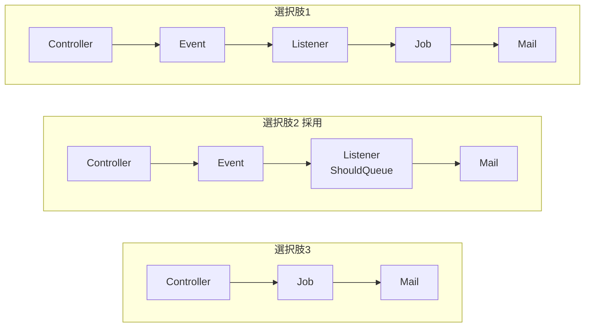
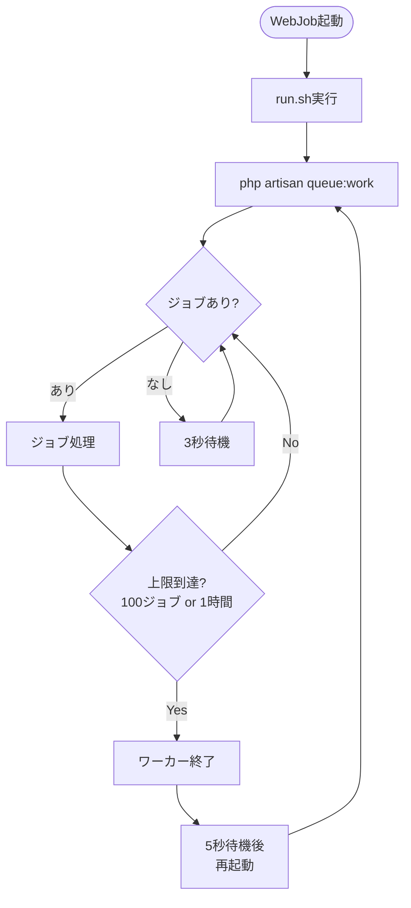

## はじめに

本記事では、Azure App Service上でLaravelのキューワーカーを使い、非同期でメール送信を行う実装について解説する。

メール送信のような外部サービスとの通信は、同期処理で行うとユーザーを待たせてしまう。そのため、キューを使った非同期処理が望ましい。Laravelにはキューの仕組みが標準で備わっており、Azure App ServiceのWebJob機能と組み合わせることで、追加のインフラを用意することなく非同期処理を実現できる。

## 技術スタック

今回の実装で使用した技術スタックは以下の通りである。

- Azure App Service（Linux）
- Laravel 12
- PHP 8.4
- データベースキュードライバ（SQL Server）

Laravelのキュードライバとしてdatabaseを採用した理由は、Redisなどの追加インフラが不要であり、既存のデータベースをそのまま利用できるためである。

## アーキテクチャ設計

### 処理フロー

今回採用した処理フローは以下の構成である。


ユーザーが登録または更新すると、Controllerがデータベースへの保存を完了した後にEventを発火する。通常、ListenerのhandleメソッドはEvent発火時に即座に実行されるが、ListenerにShouldQueueインターフェースを実装すると動作が変わる。handleメソッドを即座に実行する代わりに、「このListenerをこのデータで後で実行する」という情報がデータベースの `jobs` テーブルにレコードとして保存される。これが「キューに投入される」ということである。レコードの保存だけで済むため、Controllerはすぐにレスポンスを返せる。

その後、別プロセスとして常駐しているキューワーカー（`php artisan queue:work`）が `jobs` テーブルを定期的にポーリングし、レコードを見つけるとhandleメソッドを実行してメールを送信する。

### なぜこの構成を選んだか

Laravelでメール送信を非同期化する方法はいくつかある。検討した選択肢は以下の3つであった。



1. Event → Listener → Job → Mail
2. Event → Queueable Listener → Mail
3. Controller → Job 直接

選択肢1はListener自体がShouldQueueでキュー化できる以上、間にJobクラスを挟む意味が薄く、不要なクラスが増えるだけである。選択肢3はシンプルだが、Controllerがメール送信という副作用を直接知ることになる。同じイベントに対して複数の処理（メール送信、ログ記録など）を追加する際にControllerの修正が必要になり、拡張性が低い。

最終的に選択肢2の「Event → Queueable Listener → Mail」を採用した。Event/Listenerによる疎結合を維持しつつ、不要なJobクラスを省略できる点が決め手となった。将来的に処理を追加する場合も、新しいListenerを追加するだけでControllerを修正せずに対応できる。

## Laravelの実装解説

### マイグレーションの準備

databaseキュードライバを使用するには、ジョブを保持するテーブルのマイグレーションが必要である。以下のコマンドでマイグレーションファイルを生成し、実行する。

```bash
php artisan make:queue-table
php artisan make:queue-failed-table
php artisan migrate
```

これにより `jobs` テーブルと `failed_jobs` テーブルが作成される。`jobs` テーブルはキューに投入されたジョブを保持し、`failed_jobs` テーブルはすべてのリトライが失敗したジョブを記録する。

### Eventクラスの作成

Eventクラスはシンプルな構造である。Inquiryモデルをコンストラクタで受け取り、SerializesModelsトレイトを使ってキューにシリアライズできるようにする。

```php
<?php

declare(strict_types=1);

namespace App\Events\Inquiry;

use App\Models\Inquiry;
use Illuminate\Foundation\Events\Dispatchable;
use Illuminate\Queue\SerializesModels;

class InquiryCreated
{
    use Dispatchable;
    use SerializesModels;

    public function __construct(
        public readonly Inquiry $inquiry
    ) {}
}
```

InquiryUpdatedも同様の構造で作成した。

### Listenerクラスの作成

ListenerにShouldQueueインターフェースを実装することで、handleメソッドの処理が自動的にキューに投入される。これがQueueable Listenerパターンの特徴である。

```php
<?php

declare(strict_types=1);

namespace App\Listeners\Inquiry;

use App\Events\Inquiry\InquiryCreated;
use App\Mail\Inquiry\InquiryCreatedMail;
use Illuminate\Contracts\Queue\ShouldQueue;
use Illuminate\Support\Facades\Log;
use Illuminate\Support\Facades\Mail;
use Throwable;

class SendInquiryCreatedNotification implements ShouldQueue
{
    public $queue = 'default';
    public int $tries = 3;
    public int $timeout = 60;
    public bool $afterCommit = true;

    public function handle(InquiryCreated $event): void
    {
        $emails = config('inquiry.notification.emails');

        if (empty($emails)) {
            Log::info('問い合わせ登録通知の通知先メールアドレスが設定されていません', [
                'inquiry_id' => $event->inquiry->id,
            ]);
            return;
        }

        $event->inquiry->loadMissing('category');

        foreach ($emails as $email) {
            Mail::to($email)->send(new InquiryCreatedMail($event->inquiry));
            Log::info('問い合わせ登録通知のメール送信完了', [
                'inquiry_id' => $event->inquiry->id,
                'inquiry_number' => $event->inquiry->inquiry_number,
                'to' => $email,
            ]);
        }
    }

    public function failed(InquiryCreated $event, Throwable $exception): void
    {
        Log::error('問い合わせ登録通知のメール送信失敗', [
            'inquiry_id' => $event->inquiry->id,
            'inquiry_number' => $event->inquiry->inquiry_number,
            'error' => $exception->getMessage(),
        ]);
    }
}
```

`$tries`プロパティで最大リトライ回数、`$timeout`プロパティでタイムアウト秒数を指定できる。failedメソッドを定義しておくと、すべてのリトライが失敗した場合に呼び出される。

`$afterCommit = true` を設定すると、データベーストランザクションのコミット後にのみキューへジョブが投入される。これにより、トランザクションがロールバックされた場合にジョブが投入されることを防げる。

### イベントの発火

Controllerでイベントを発火する。Listenerに `$afterCommit = true` を設定しているため、トランザクション内でイベントを発火してもコミット後にジョブが投入される。ロールバック時にメールだけ送信されてしまう心配はない。

```php
DB::beginTransaction();

// データ保存処理

DB::commit();

event(new \App\Events\Inquiry\InquiryCreated($inquiry));

return new JsonResponse([
    'inquiryId' => $inquiry->id,
    'message' => 'Success',
], 200);
```

### イベントとリスナーの紐付け

Laravel 12ではイベントリスナーの自動ディスカバリーがデフォルトで有効になっている。app/Listenersディレクトリに配置したListenerは、handleメソッドの型宣言から自動的にEventと紐付けられる。そのため、EventServiceProviderでの明示的な登録は不要である。

## WebJobとは

WebJobはAzure App Serviceの機能で、Webアプリケーションと同じ環境内でバックグラウンド処理を実行できる。追加のインフラを用意する必要がなく、Kuduによって実行やログ管理が行われる。


WebJobには主に3つの種類がある。

- Triggered WebJobは手動起動や外部からのAPI呼び出しで動作する
- Scheduled WebJobはTriggered WebJobの一種で、NCRONTAB式でスケジュール実行される
- Continuous WebJobは常駐型で動き続ける

今回はContinuous WebJobを採用した。Laravelの `queue:work` は常駐してキューをポーリングし続けるプロセスとして設計されており、Continuous WebJobの常駐型の仕組みと自然に合致する。Scheduled WebJobで実現しようとすると `queue:work --stop-when-empty` をcronで定期実行する形になるが、cron間隔の遅延が生じるだけでなく、前回の実行がまだ終わっていない場合の制御など余計な考慮が必要になる。

ただし、Continuous WebJobを使用するにはApp ServiceのAlways Onを有効化する必要があり、Basic以上のプランが必要となる。

## キューワーカーの設定

### ディレクトリ構造

WebJobはApp Serviceの特定のディレクトリ配下で検出される。Continuous WebJobの場合、以下のパスに配置する。Kuduは `run.*` という名前のファイルをエントリポイントとして探して実行する。

```
site/wwwroot/App_Data/jobs/continuous/queue-worker/
├── run.sh
└── settings.job
```

### キューワーカースクリプト

run.shでは、Laravelのqueue:workコマンドを無限ループで実行する。



```bash
#!/bin/bash
cd /home/site/wwwroot/system
while true; do
  /usr/local/bin/php artisan queue:work --sleep=3 --tries=3 --max-jobs=100 --max-time=3600
  echo "Queue worker restarting..."
  sleep 5
done
```

無限ループで囲んでいる理由は2つある。1つ目は、`--max-jobs` や `--max-time` による正常終了後にワーカーを再起動するためである。2つ目は、OOMや未捕捉の例外による異常終了時にもワーカーを自動復旧させるためである。sleep 5を挟むことで、異常終了が連続した場合にCPUを占有し続けることを防いでいる。

各オプションの意味は以下の通りである。

- `--sleep=3` はキューが空のとき、次のポーリングまで3秒待機する
- `--tries=3` はジョブの最大リトライ回数を指定する。Listener側に `$tries` プロパティが定義されている場合はそちらが優先され、コマンドラインオプションはフォールバックとして機能する
- `--max-jobs=100` は100ジョブ処理したら再起動する
- `--max-time=3600` は1時間経過したら再起動する

`--max-jobs` と `--max-time` はメモリリークを防ぐための設定である。長時間動作し続けるとメモリを消費し続ける可能性があるため、定期的に再起動させるのがベストプラクティスとされている。

### シングルトン設定

App Serviceがスケールアウトして複数インスタンスで動作する場合、各インスタンスでキューワーカーが起動する。settings.jobの `is_singleton` で制御できる。

```json
{
  "is_singleton": true
}
```

今回は `is_singleton` をtrueにし、1つのインスタンスでのみワーカーを実行する構成にした。メール通知の処理量が限定的であり、複数ワーカーで並列処理する必要がなかったためである。Laravelのdatabaseキュードライバーは排他制御を提供しているため、仮にfalseにして複数ワーカーが動作しても同じジョブが二重処理されることはない。処理量が増えた場合はfalseに変更して並列処理に切り替えられる。

## 実装時に起きた問題と解決策

### キューワーカーが環境変数の変更を反映しない

メールの送信先やSMTPサーバーの接続情報を環境変数で管理していたが、App Serviceの設定画面で環境変数を更新してもメールが送信されない問題が発生した。キューワーカー自体は動作しており、ジョブの処理ログは出力されていた。

原因は、キューワーカーが起動時の設定をメモリに保持し続けることにあった。`queue:work` は常駐プロセスであるため、起動後に環境変数を変更してもプロセスが保持している古い値が使われ続ける。結果として、更新前の（存在しない）SMTP設定でメール送信を試みて失敗していた。

解決策として、以下のコマンドを実行してキューワーカーを再起動する必要がある。

```bash
php artisan queue:restart
```

このコマンドはキャッシュに再起動シグナルを書き込み、ワーカーが次のジョブを処理した後に再起動するよう指示する。デプロイ時や環境変数更新時には、このコマンドをスタートアップスクリプトに含めておくとよい。

## まとめ

Azure App Service上でLaravelのキューワーカーを使ったメール送信の実装について解説した。Event/Listenerパターンにより疎結合を維持しつつ、Continuous WebJobでキューワーカーを常駐させることで、追加インフラなしに非同期メール送信を実現できた。

個人的には、LaravelのQueueable Listenerパターンは非常に使いやすいと感じた。ShouldQueueインターフェースを実装するだけで非同期化できる手軽さは、Laravelの強みの一つである。一方で、キューワーカーの再起動が必要なことは忘れがちなポイントであり、デプロイパイプラインに組み込んでおくことを強く推奨する。

## 参考資料

- Azure App ServiceでのWebジョブの実行方法（Microsoft Learn）
  https://learn.microsoft.com/ja-jp/azure/app-service/webjobs-execution

- Laravel Queues（Laravel公式ドキュメント）
  https://laravel.com/docs/12.x/queues

- Laravel Events（Laravel公式ドキュメント）
  https://laravel.com/docs/12.x/events
