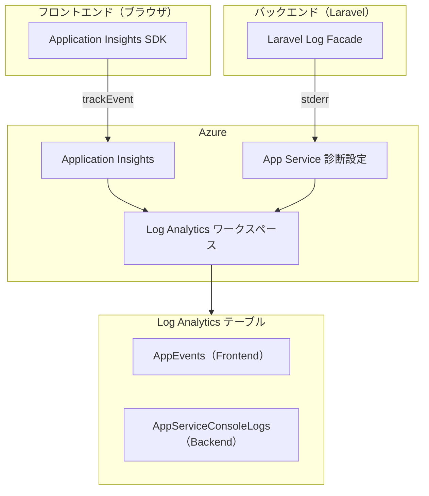
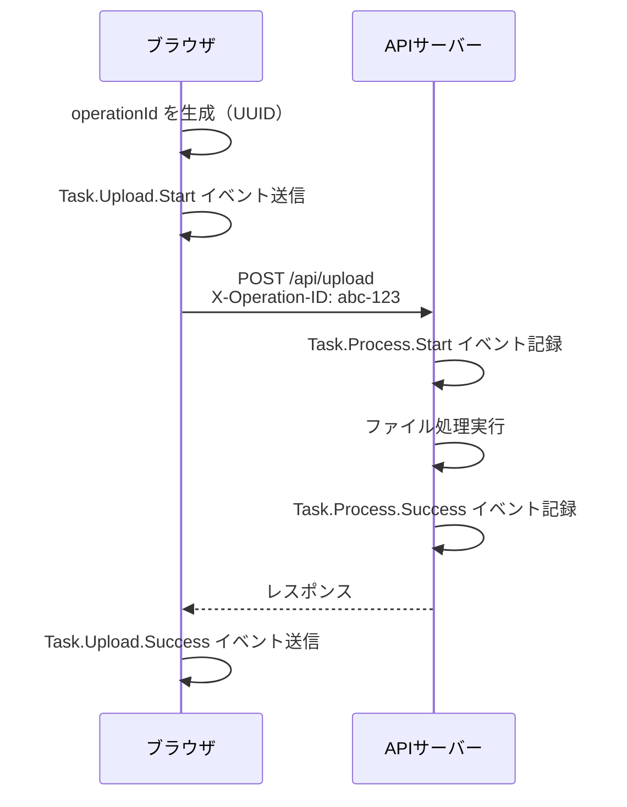
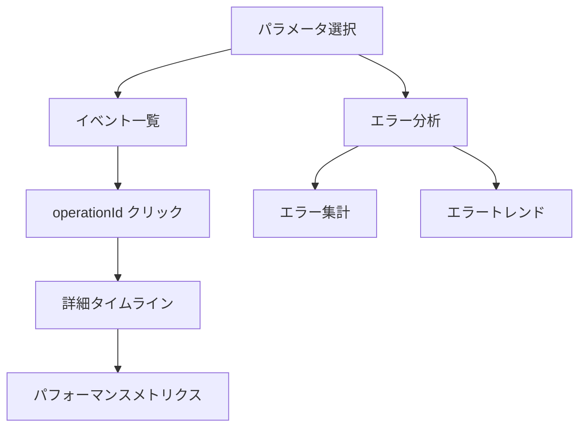

## はじめに
 
Webアプリケーションの運用において、ユーザー操作の追跡や問題発生時の原因特定は避けて通れない課題である。
特に、フロントエンド（ブラウザ）とバックエンド（サーバー）にまたがる処理では、両者のログを紐付けて確認できないと、問題の全体像を把握することが困難になる。
 
本記事では、Azure Monitor / Application Insights を活用し、フロントエンドとバックエンドのログを統合的に管理・分析できるテレメトリ基盤を構築した経験を共有する。Laravel + React（TypeScript）構成のWebアプリケーションを対象とする。
 
## なぜテレメトリが必要なのか
 
### 運用現場での課題
 
運用中のWebアプリケーションで「ファイルアップロードが失敗した」という問い合わせを受けたとき、以下のような情報が必要になる。運用していたログの管理方法だと、フロントエンドとバックエンドのログが分離しており、これらの情報を紐付けて確認することが難しかった。
 
- いつ、誰が操作したのか
- フロントエンドでエラーが発生したのか、バックエンドで発生したのか
- どの処理ステップで失敗したのか

### テレメトリで解決できること
 
統合テレメトリ基盤を構築することで、以下が実現できる。
 
- 一連の操作を `operationId` で紐付け、フロントエンドからバックエンドまでの処理フローを可視化
- エラー発生箇所、エラータイプ、発生頻度を集計し、改善の優先順位付けに活用
 
## アーキテクチャ設計
 
### 全体構成
 
今回採用したアーキテクチャは「ワークスペースベースの Application Insights」を活用した構成である。
 

 
この構成のポイントは、フロントエンドとバックエンドのログが**同一の Log Analytics ワークスペースに集約される**点である。これにより、KQL（Kusto Query Language）を使った統合クエリが可能になる。
 
### operationId による紐付け
 
フロントエンドとバックエンドのログを紐付けるために、`operationId` という一意の識別子を使用する。
 

 
この仕組みにより、同一の `operationId` で検索すれば、一連の処理に関わるすべてのログを時系列で確認できる。
 
## 設計上の判断
 
### イベント命名規約
 
イベント名は `{Domain}.{Action}.{Result}` の形式で統一した。
 
| 例 | 説明 |
|---|---|
| `Task.Upload.Start` | ファイルアップロード開始 |
| `Task.Upload.Success` | ファイルアップロード成功 |
| `Task.Process.Failure` | ファイル処理失敗 |
| `Task.Store.ValidationError` | データ登録のバリデーションエラー |
 
この命名規約により、ログを見ただけで「何が」「どうなったか」が一目で分かる。また、フィルタリングも容易になる。
 
## 可視化のために、Azure Workbookを活用
 
ログを収集しても、分析しやすい形で可視化されていなければ宝の持ち腐れである。
Azure Workbook を使用して、運用担当者が直感的に操作できるダッシュボードを構築した。
 
### Workbook の構成
 

 
## 実装から得た知見
 
### Application Insights と Log Analytics の関係
 
これは私自身も最初は混乱した点である。両者の関係を簡潔に説明すると以下のようになる。
 
| コンポーネント | 役割 | 例え |
|--------------|------|------|
| Application Insights | データを収集・送信するSDK/サービス | カメラ |
| Log Analytics ワークスペース | データを保存・検索する場所 | データベース |
 
「ワークスペースベースの Application Insights」では、Application Insights で収集したデータが自動的に Log Analytics ワークスペースに保存される。このため、Frontend（Application Insights SDK 経由）と Backend（App Service のコンソールログ）のデータを同じ場所で統合クエリできる。
 
### バックエンドのログ出力先
 
Laravel からのログ出力先として、以下の選択肢を検討した。
 
| 方式 | メリット | デメリット |
|-----|---------|-----------|
| ファイル出力 | シンプル | Azure Monitor に連携できない |
| stderr 出力 | App Service 診断設定で Azure Monitor に自動転送 | ログレベルが Error として表示される |
| HTTP で Application Insights に直接送信 | 完全な統合 | 実装コスト高、レイテンシ増加 |
 
最終的に「stderr 出力 + App Service 診断設定」を採用した。実装コストが低く、既存の Laravel ログ基盤をそのまま活用できる点が決め手となった。stderr 経由のログが `Error` レベルとして表示される点は運用上の注意点だが、ログの内容（JSON）で適切にフィルタリングすれば問題にならない。
 
### 統合クエリのコツ
 
Frontend と Backend のログを統合クエリする際、テーブル構造の違いを吸収する必要がある。
 
- **Frontend（AppEvents）**
    - 構造化された Properties を持つ
- **Backend（AppServiceConsoleLogs）**
    - JSON 文字列として `ResultDescription` に格納
 
Backend のログから値を抽出するには、KQL の `extract` 関数を使用する。
 
```kusto
extract('"operationId":"([^"]+)"', 1, ResultDescription)
```
 
この正規表現による抽出は、JSON をパースするより高速だが、JSON 構造が変わると動かなくなるリスクがある。
運用では、ログ形式の変更時にクエリも合わせて修正することを忘れないようにする必要がある。
 
## 実装例
 
### Frontend（TypeScript）
 
#### テレメトリユーティリティの実装
 
まず、テレメトリ送信のためのユーティリティモジュールを作成する。
 
```typescript
// Utils/telemetry.ts
import { appInsights } from './AppInsightService';
 
const appName = import.meta.env.VITE_APP_NAME || 'my-app';
 
// SDKのコンテキストに依存せず明示的にuserIdを記録
let telemetryUserId: string | undefined;
 
export const setTelemetryUserId = (userId: string | undefined): void => {
  telemetryUserId = userId;
};
 
// イベント命名規約: {Domain}.{Action}.{Result}
export type TelemetryDomain = 'Task';
export type TelemetryAction = 'Upload' | 'Store' | 'Process';
export type TelemetryResult = 'Start' | 'Success' | 'Failure' | 'ValidationError';
 
// operationId を生成
export const generateOperationId = (): string => {
  return crypto.randomUUID();
};
   
// 例外を追跡
export const trackException = async (
  error: Error,
  properties: Record<string, string | number | boolean | undefined>,
): Promise<void> => {
  appInsights.trackException({
    exception: error,
    properties: {
      ...properties,
      appName,
      category: 'Frontend',
      ...(telemetryUserId && { userId: telemetryUserId }),
    },
  });
};

// イベントを追跡
export const trackEvent = (
  domain: TelemetryDomain,
  action: TelemetryAction,
  result: TelemetryResult,
  properties: Record<string, string | number | boolean | undefined>,
): void => {
  const eventName = `${domain}.${action}.${result}`;
  appInsights.trackEvent({
    name: eventName,
    properties: {
      ...properties,
      appName,
      category: 'Frontend',
      ...(telemetryUserId && { userId: telemetryUserId }),
    },
  });
};

```
 
#### ファイルアップロード処理での使用例
 
```typescript
// Hooks/useUploadFile.ts
import {
  generateOperationId,
  trackEvent,
  trackException,
} from '@/Utils/telemetry';
 
export const useUploadFile = () => {
  const upload = async (file: File) => {
    const operationId = generateOperationId();
 
    // Start イベント
    trackEvent('Task', 'Upload', 'Start', {
      operationId,
    });
 
    const formData = new FormData();
    formData.append('file', file);
 
    try {
      const response = await axios.post('/api/upload', formData, {
        headers: {
          'X-Operation-ID': operationId, // バックエンドにoperationIdを伝播
        },
      });
 
      // Success イベント
      trackEvent('Task', 'Upload', 'Success', {
        operationId,
      });
 
      return response.data;
    } catch (error) {
      const err = error instanceof Error ? error : new Error(String(error));
 
      // Failure イベント
      trackEvent('Task', 'Upload', 'Failure', {
        operationId,
        errorType: err.name,
        stage: 'upload',
      });
 
      // 例外を追跡（スタックトレースのハッシュ化等）
      await trackException(err, {
        operationId,
        stage: 'upload',
      });
 
      throw error;
    }
  };
 
  return { upload };
};
```
 
#### データ登録処理での使用例
 
```typescript
// Hooks/useStoreRecord.ts
import { AxiosError } from 'axios';
import {
  generateOperationId,
  trackEvent,
  trackException,
} from '@/Utils/telemetry';
 
export const useStoreRecord = () => {
  const store = async (data: RecordParams) => {
    const operationId = generateOperationId();
 
    // Start イベント
    trackEvent('Task', 'Store', 'Start', {
      operationId,
      recordType: data.type,
    });
 
    try {
      const response = await axios.post('/api/records', data, {
        headers: {
          'X-Operation-ID': operationId,
        },
      });
 
      // Success イベント
      trackEvent('Task', 'Store', 'Success', {
        operationId,
        recordId: response.data.id,
      });
 
      return response;
    } catch (error) {
      const err = error instanceof Error ? error : new Error(String(error));
 
      // バリデーションエラーの場合は専用イベント
      if (error instanceof AxiosError && error.response?.status === 422) {
        const invalidFields = Object.keys(error.response.data?.errors || {});
 
        trackEvent('Task', 'Store', 'ValidationError', {
          operationId,
          invalidFields: JSON.stringify(invalidFields),
          errorCount: invalidFields.length,
        });
      } else {
        // その他のエラー
        trackEvent('Task', 'Store', 'Failure', {
          operationId,
          errorType: err.name,
          stage: 'store',
        });
 
        await trackException(err, { operationId, stage: 'store' });
      }
 
      throw error;
    }
  };
 
  return { store };
};
```
 
### Backend（Laravel / PHP）
 
#### TelemetryService の実装
 
```php
// app/Services/TelemetryService.php
<?php
 
namespace App\Services;
 
use Illuminate\Support\Facades\Log;
use Illuminate\Support\Str;
use Throwable;
 
class TelemetryService
{
    private float $startTime;
    private string $operationId;
 
    public function __construct(?string $operationId = null)
    {
        $this->startTime = microtime(true);
        $this->operationId = $operationId ?? (string) Str::uuid();
    }
 
    public function getOperationId(): string
    {
        return $this->operationId;
    }
  
    /**
     * イベントを記録
     */
    public function trackEvent(
        string $domain,
        string $action,
        string $result,
        array $properties = []
    ): void {
        $eventName = "{$domain}.{$action}.{$result}";
        Log::info($eventName, $this->buildContext($properties));
    }
 
    /**
     * 例外を記録
     */
    public function trackException(
        Throwable $exception,
        array $properties = []
    ): void {
        $sanitizedMessage = $this->sanitizeErrorMessage($exception->getMessage());
        $stackHash = $this->hashStack($exception->getTraceAsString());
 
        Log::error($sanitizedMessage, $this->buildContext([
            ...$properties,
            'errorType' => get_class($exception),
            'errorMessage' => $sanitizedMessage,
            'stackHash' => $stackHash,
        ]));
    }
 
    /**
     * 共通コンテキストを構築
     */
    private function buildContext(array $properties = []): array
    {
        $userId = request()->user()?->id;
 
        return [
            ...$properties,
            'appName' => config('app.name'),
            'category' => 'Backend',
            'operationId' => $this->operationId,
            'userId' => $userId ? (string) $userId : null,
        ];
    }
 
    /**
     * エラーメッセージをサニタイズ
     */
    private function sanitizeErrorMessage(string $message): string
    {
        $message = preg_replace('#/[^\s]+#', '[PATH]', $message) ?? $message;
        return mb_substr($message, 0, 500);
    }

    /**
     * スタックトレースをハッシュ化
     */
    private function hashStack(string $stack): string
    {
        return substr(hash('sha256', $stack), 0, 16);
    }
 
    /**
     * ファクトリメソッド
     */
    public static function start(?string $operationId = null): self
    {
        return new self($operationId);
    }
}
```
 
#### Controller での使用例
 
```php
// app/Http/Controllers/Api/UploadController.php
<?php
 
namespace App\Http\Controllers\Api;
 
use App\Http\Controllers\Controller;
use App\Services\TelemetryService;
use Illuminate\Http\Request;
use Throwable;
 
class UploadController extends Controller
{
    public function __invoke(Request $request)
    {
        // フロントから送信された operationId を受け取る
        $operationId = $request->header('X-Operation-ID');
        $telemetry = TelemetryService::start($operationId);
  
        // Start イベント
        $telemetry->trackEvent('Task', 'Process', 'Start');
 
        try {
            $result = $this->processFile($file);
 
            // Success イベント
            $telemetry->trackEvent('Task', 'Process', 'Success');
 
            return response()->json($result);
        } catch (Throwable $e) {
            // Failure イベント
            $telemetry->trackEvent('Task', 'Process', 'Failure', [
                'errorType' => get_class($e),
                'stage' => 'process',
            ]);
 
            // 例外を追跡
            $telemetry->trackException($e, [
                'stage' => 'process',
            ]);
 
            throw $e;
        }
    }
}
```
 
#### データ登録 Controller での使用例
 
```php
// app/Http/Controllers/Api/RecordController.php
<?php
 
namespace App\Http\Controllers\Api;
 
use App\Http\Controllers\Controller;
use App\Services\TelemetryService;
use Illuminate\Http\JsonResponse;
use Illuminate\Http\Request;
use Illuminate\Support\Facades\DB;
use Throwable;
 
class RecordController extends Controller
{
    public function store(Request $request): JsonResponse
    {
        $operationId = $request->header('X-Operation-ID');
        $telemetry = TelemetryService::start($operationId);
 
        // Start イベント
        $telemetry->trackEvent('Task', 'Store', 'Start', [
            'recordType' => $request->input('type'),
        ]);
 
        DB::beginTransaction();
        try {
            // バリデーション
            $errors = $this->validate($request);
 
            if ($errors->isNotEmpty()) {
                // ValidationError イベント
                $telemetry->trackEvent('Task', 'Store', 'ValidationError', [
                    'errorCount' => $errors->count(),
                ]);
 
                return new JsonResponse([
                    'message' => 'Validation Error',
                    'errors' => $errors,
                ], 422);
            }
 
            $record = $this->createRecord($request);
 
            DB::commit();
 
            // Success イベント
            $telemetry->trackEvent('Task', 'Store', 'Success', [
                'recordId' => $record->id,
            ]);
 
            return new JsonResponse([
                'message' => 'Success',
                'data' => ['id' => $record->id],
            ]);
        } catch (Throwable $e) {
            DB::rollBack();
 
            $telemetry->trackEvent('Task', 'Store', 'Failure', [
                'errorType' => get_class($e),
                'stage' => 'store',
            ]);
 
            $telemetry->trackException($e, ['stage' => 'store']);
 
            throw $e;
        }
    }
}
```
 
### operationId による紐付けのポイント
 
上記の実装例で重要なのは、以下の流れである。
 
1. Frontendで`generateOperationId()`を使い、operationIdとしてUUIDを生成
2. 処理開始時に operationId を含めてイベント送信
3. `X-Operation-ID` ヘッダーでバックエンドに渡す
4. `$request->header('X-Operation-ID')` で取得し、同じ operationId でログを記録
5. Success/Failureで終了記録を記録
 
これにより、Log Analytics で以下のようなクエリを実行することで、一連の処理フローを時系列で確認できる。
 
```kusto
let targetOperationId = "abc-123-def-456";
 
// Frontend のイベント
AppEvents
| where Properties.operationId == targetOperationId
| project TimeGenerated, Name, Properties
 
// Backend のイベント（JSON から抽出）
AppServiceConsoleLogs
| where ResultDescription contains targetOperationId
| project TimeGenerated, ResultDescription
```
 
## まとめ
 
本記事では、Laravel + React 構成の Web アプリケーションにおけるフロントエンド・バックエンド統合テレメトリの実装について解説した。
 
### 実現したこと
 
1. 一連の操作をフロントエンドからバックエンドまで追跡可能に
2. 運用担当者が直感的に調査できるダッシュボード
 
### 今後の展望
 
現状の構成でも十分に実用的だが、以下の改善を検討している。
 
- エラー率が閾値を超えた場合に Slack/Teams に通知
- TelemetryService を社内 npm/composer パッケージとして提供し、社内システムの監視基盤を標準化
 
テレメトリ基盤は一度構築して終わりではなく、運用を通じて継続的に改善していくものである。本記事が、同様の課題に取り組む方々の参考になれば幸いである。
 
## 参考資料
 
- [Azure Monitor の概要 - Microsoft Learn](https://learn.microsoft.com/ja-jp/azure/azure-monitor/overview)
- [Application Insights の概要 - Microsoft Learn](https://learn.microsoft.com/ja-jp/azure/azure-monitor/app/app-insights-overview)
- [Log Analytics ワークスペース - Microsoft Learn](https://learn.microsoft.com/ja-jp/azure/azure-monitor/logs/log-analytics-workspace-overview)
- [Azure Workbooks - Microsoft Learn](https://learn.microsoft.com/ja-jp/azure/azure-monitor/visualize/workbooks-overview)
- [Application Insights JavaScript SDK API Reference - GitHub](https://github.com/microsoft/ApplicationInsights-JS/blob/master/API-reference.md)