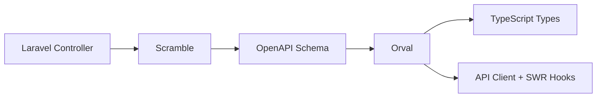
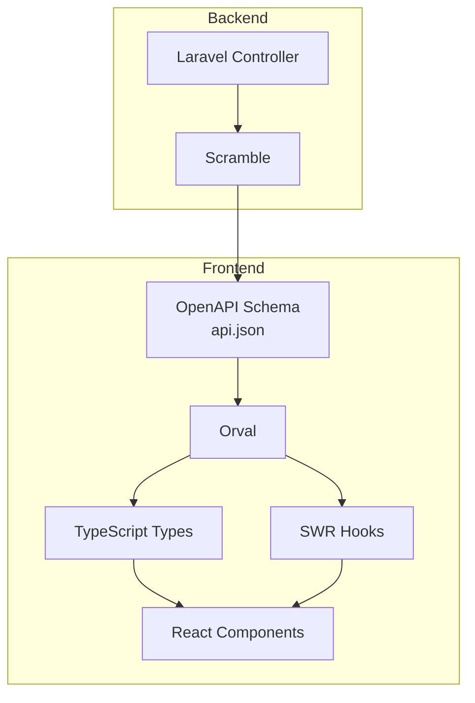

## はじめに

フロントエンドとバックエンドの型の不整合は、開発現場で頻繁に発生する問題である。API仕様の変更がフロントエンドに伝わらず、実行時エラーが発生するケースは珍しくない。この問題を解決するアプローチの一つが「スキーマ駆動開発」である。

本記事では、Laravel + React（TypeScript）のプロジェクトにおいて、ScrambleとOrvalを組み合わせたスキーマ駆動開発の実践例を紹介する。私が実際のプロジェクトで採用している構成をもとに、設定や設計上の工夫を共有する。

## スキーマ駆動開発とは

スキーマ駆動開発とは、APIの仕様（スキーマ）を中心に据えた開発手法である。OpenAPI仕様書をSingle Source of Truth（信頼できる唯一の情報源）として、そこからバックエンドとフロントエンドのコードを生成または検証する。



このアプローチの利点は以下の通りである。

1. フロントエンドとバックエンドで型が自動的に同期される
2. コードからAPI仕様書が自動生成される
3. IDEの補完が効き、タイポによるバグが減少する

## Scrambleについて

[Scramble](https://scramble.dedoc.co/)は、LaravelアプリケーションからOpenAPIドキュメントを自動生成するパッケージである。PHPDocやLaravelの規約からスキーマを推論するため、追加のアノテーションを最小限に抑えられる点が特徴である。

### 基本的な使い方

Scrambleは、コントローラーの返り値の型アノテーションからレスポンススキーマを推論する。

```php
/**
 * @tags User
 */
class IndexController extends Controller
{
    /**
     * ユーザー一覧取得
     */
    public function __invoke(IndexRequest $request): AnonymousResourceCollection
    {
      $users = User::all();
      return UserResource::collection($users);
    }
}
```

`@tags`アノテーションでAPIをグループ化できる。


### Resourcesの設計指針

Eloquent API Resourcesは、モデルをJSONに変換する際の形式を定義するクラスである。Scrambleは、Resourceクラスの`toArray()`メソッドからレスポンススキーマを推論する。

#### 権限別にResourceを分ける

管理者と一般ユーザーでレスポンス構造が異なるケースは多い。例えば、管理者にのみ表示される機密情報があるような場合である。

このとき、1つのResourceで条件分岐するのではなく、権限ごとに別のResourceを作成することを推奨する。私の経験では、Scrambleが条件分岐を正確に解釈できず、OpenAPIスキーマが期待通りに生成されないことがあるためである。

次の実装方法がある。

**方法① 各Resourceを独立して定義する**

シンプルで分かりやすい方法である。各Resourceが独立しているため、変更の影響範囲が明確になる。

```php
class UserResource extends JsonResource
{
    /** @var User */
    public $resource;

    /**
     * @return array<string, mixed>
     */
    public function toArray(Request $request): array
    {
        return [
            'userId' => $this->resource->user_id,
            'name' => $this->resource->name,
            'email' => $this->resource->email,
            'isAdmin' => $this->resource->is_admin,
        ];
    }
}
```

```php
class AdminUserResource extends JsonResource
{
    /** @var User */
    public $resource;

    /**
     * @return array<string, mixed>
     */
    public function toArray(Request $request): array
    {
        return [
            'userId' => $this->resource->user_id,
            'name' => $this->resource->name,
            'email' => $this->resource->email,
            'isAdmin' => $this->resource->is_admin,
            'secret' => $this->resource->secret,
        ];
    }
}
```

**方法② 基礎Resourceを内部で利用する**

共通フィールドが多い場合に有効である。DRY原則を守りつつ、Scrambleの型推論も正しく動作する。

```php
class AdminUserResource extends JsonResource
{
    /** @var User */
    public $resource;

    public function toArray(Request $request): array
    {
        return [
            ...(new UserResource($this->resource))->toArray($request),
            'secret' => $this->resource->secret,
            'createdAt' => $this->resource->created_at->toIso8601String(),
        ];
    }
}
```

`UserResource`をインスタンス化して`toArray()`を呼び出し、スプレッド構文でマージしている。

**どちらを選ぶか**

- **方法①**: フィールド数が少ない、または各Resourceの独立性を重視する場合
- **方法②**: 共通フィールドが多く、変更時の修正漏れを防ぎたい場合

**なぜ継承を使わないのか**

Resourceの継承（`class AdminUserResource extends UserResource`）という選択肢もあるが、採用していない。理由は、Scrambleが親クラスの`toArray()`の返り値型を子クラスに引き継いで解釈しないためである。継承を使うと、OpenAPIスキーマ上で親クラスのフィールドが欠落することがある。

コンポジション（内部でインスタンス化して利用）の方が、Scrambleの型推論と相性が良い。

### 複雑なレスポンスになる時

単一のResourceを返すだけでなく、複数のオブジェクトを組み合わせたレスポンスが必要な場合もあるが、その時はカスタムレスポンス構造を潔く使っている。

Resourceを使わずにカスタム構造のJSONを返す場合もある。

```php
/**
 * @tags User
 */
class ShowController extends Controller
{
    /**
     * ユーザー詳細を取得
     *
     * @return array{
     *   user: UserResource,
     *   relatedUsers: array<int, UserResource>,
     *   metadata: array{totalCount: int, lastUpdated: string}
     * }
     */
    public function __invoke(ShowRequest $request): JsonResponse
    {
        $user = User::findOrFail($request->userId);
        $relatedUsers = $user->relatedUsers()->get();

        return new JsonResponse([
            'user' => new UserResource($user),
            'relatedUsers' => UserResource::collection($relatedUsers),
            'metadata' => [
                'totalCount' => $relatedUsers->count(),
                'lastUpdated' => now()->toIso8601String(),
            ],
        ]);
    }
}
```

この場合、Scrambleはレスポンス構造を推論するが、複雑になる場合は正確に推論できないこともある。`@return`アノテーションで配列シェイプを明示的に記述することで、Scrambleが正確なスキーマを生成できるようになる。

### FormRequestでパスパラメータを使う時

RESTfulなAPIでは、`/companies/{companyId}/calendars`のようなパスパラメータを使うことが多い。FormRequestでパスパラメータをバリデーションしたい場合、`prepareForValidation()`メソッドを使用する。

```php
class DeleteRequest extends FormRequest
{
    protected function prepareForValidation(): void
    {
        $this->merge([
            'userId' => $this->route('userId'),
        ]);
    }

    /**
     * @return array<string, \Illuminate\Contracts\Validation\ValidationRule|array<mixed>|string>
     */
    public function rules(): array
    {
        return [
            /** @ignoreParam */
            'userId' => ['required', 'integer', 'exists:users'],
        ];
    }
}
```

ここで重要なのは`@ignoreParam`アノテーションである。パスパラメータはOpenAPIでは既にpathで定義されているため、Scrambleにクエリパラメータとして二重に出力されることを防ぐ必要がある。このアノテーションがないと、OpenAPIスキーマ上でパスパラメータがクエリパラメータとしても出力されてしまう。

## Orvalについて

[Orval](https://orval.dev/)は、OpenAPI仕様からTypeScriptのAPIクライアントコードを生成するツールである。axios、fetch、Angular HttpClientなど様々なHTTPクライアントに対応しており、SWR（stale-while-revalidate戦略を採用したReact向けデータフェッチングライブラリ）やReact Queryなどのデータフェッチングライブラリとの統合も可能である。

### なぜOrvalを選んだか

OpenAPIからTypeScriptコードを生成するツールは他にもある（openapi-generator、swagger-codegenなど）。私がOrvalを採用した理由は以下の通りである。

1. SWRとの親和性があり、カスタムフックを自動生成できる
2. nullableやunion型の扱いが適切
3. JavaScript/TypeScriptで設定を記述できる

### Orvalの設定

```javascript
// orval.config.cjs
module.exports = {
  api: {
    input: './api.json',
    output: {
      mode: 'tags-split',
      client: 'swr',
      httpClient: 'axios',
      target: './resources/js/api/api.ts',
      schemas: './resources/js/api/schema',
      prettier: true,
      baseUrl: '/api',
      clean: true, // 生成前に既存ファイルを削除
    },
  },
};
```

各設定の意図を説明する。

**`mode: 'tags-split'`** - OpenAPIのタグごとにフォルダを分け、さらに実装・スキーマを別ファイルに分割する。バンドラーがファイル単位でtree-shakingを行うため、使用していないAPIのコードがバンドルに含まれにくくなる。

**`schemas`** - 型定義ファイルの出力先を`target`と別ディレクトリに指定することで、インポートの見通しが良くなる。

**`clean: true`** - 生成前に既存の出力ファイルを削除する。これにより、APIが削除された場合に古いクライアントコードが残る問題を防げる。

> 参考: [Orval Output Configuration](https://orval.dev/reference/configuration/output)

### 生成されるコード

Orvalは以下のようなコードを生成する。

```typescript
// 型定義
export interface UserResource {
  userId: number;
  name: string;
  email: string;
  isAdmin: boolean;
}

// APIクライアント + SWRフック
/**
 * @summary ユーザー一覧を取得
 */
export const useUserIndex = <
  TError = AxiosError<AuthenticationExceptionResponse>,
>(options?: {
  swr?: SWRConfiguration<Awaited<ReturnType<typeof userIndex>>, TError> & {
    swrKey?: Key;
    enabled?: boolean;
  };
  axios?: AxiosRequestConfig;
}) => {
  const { swr: swrOptions, axios: axiosOptions } = options ?? {};

  const isEnabled = swrOptions?.enabled !== false;
  const swrKey =
    swrOptions?.swrKey ?? (() => (isEnabled ? getUserIndexKey() : null));
  const swrFn = () => userIndex(axiosOptions);

  const query = useSwr<Awaited<ReturnType<typeof swrFn>>, TError>(
    swrKey,
    swrFn,
    swrOptions,
  );

  return {
    swrKey,
    ...query,
  };
};
```

生成されたフックは、パスパラメータが必須引数として型安全に定義されており、レスポンスの型も自動的に推論される。

### ESLintの設定

自動生成されたコードにESLintを適用すると、不要な警告が発生することがある。そのため、生成されたファイルはESLintのignoreリストに追加している。

```javascript
// eslint.config.js
export default [
  // ... 他の設定
  {
    ignores: [
      'vendor',
      'node_modules',
      'public',
      'resources/js/api/**', // Orvalで生成されたコードを除外
      // ...
    ],
  },
];
```

### Makefileで一気通貫に

OpenAPIスキーマの生成からTypeScriptコードの生成までを一連のコマンドで実行できるようにしておくと、開発効率が向上する。以下は私が使用しているMakefileの例である。

```makefile
# API仕様書の生成
export-api-json:
	./vendor/bin/sail php artisan scramble:export --path=api.json

# TypeScriptの型定義ファイルを生成
export-ts-types:
	./vendor/bin/sail yarn generate

# TypeScriptの型定義ファイルを生成
export-ts-types-from-api: export-api-json export-ts-types
	@echo "TypeScriptの型定義ファイルをAPI仕様書から生成しました"
```

## コード品質を保つために

スキーマ駆動開発を成功させるには、継続的なメンテナンスが必要である。ここでは、コード品質を維持するための自動化について説明する。

### Renovateによるパッケージ更新の工夫

[Renovate](https://docs.renovatebot.com/)は、依存パッケージの更新を自動化するツールである。ScrambleやOrvalなどのツールは頻繁にアップデートされるため、自動更新の仕組みを整えておくことが重要である。

Scrambleはバージョンアップが頻繁で、更新のたびにOpenAPIスキーマの出力形式が微妙に変わることがある。これにより、Orvalで再生成したAPIクライアントコードに差分が発生し、レビューコストが増加する。

そのため、Scrambleを個別PRにして管理する設定を追加している。

```json
{
  "packageRules": [
    {
      "matchPackageNames": ["dedoc/scramble"],
      "groupName": null,
      "minimumReleaseAge": "30 days"
    }
  ]
}
```

## CI/CDでの型チェックとテスト実行

GitHub Actionsを使って、プルリクエスト時に自動的に品質チェックを行う。
スキーマ駆動開発において特に重要なのは、TypeScriptの型チェックである。
APIスキーマが変更された場合、フロントエンドで型エラーが発生する。CIでこれを検出することで、型の不整合が本番環境に到達することを防げる。

## まとめ

本記事では、LaravelとScramble、Orvalを組み合わせたスキーマ駆動開発の実践例を紹介した。



スキーマ駆動開発の導入によって得られる最大の恩恵は、APIの型がフロントエンドとバックエンドで自動的に同期されることである。これにより、型の不整合によるバグが開発段階で発見され、本番環境での障害リスクが大幅に軽減される。

一方で、型アノテーションの記述は追加の労力を要する。特にResourceクラスでは、配列シェイプの完全な記述が必要となる。しかし、この労力は長期的には報われる。なぜなら、ドキュメントとしての役割も果たし、新しいメンバーのオンボーディングを助けると考える。

## 参考資料

- [Scramble 公式ドキュメント](https://scramble.dedoc.co/)
- [Orval 公式ドキュメント](https://orval.dev/)
- [OpenAPI Specification](https://spec.openapis.org/oas/latest.html)
- [Laravel API Resources](https://laravel.com/docs/eloquent-resources)
- [SWR 公式ドキュメント](https://swr.vercel.app/)
- [Renovate 公式ドキュメント](https://docs.renovatebot.com/)
